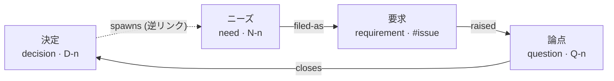
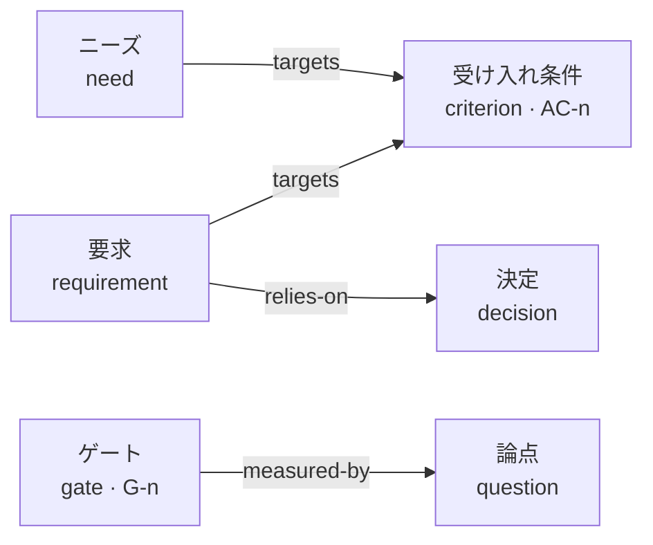
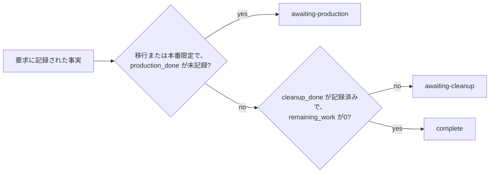

# gy — good,yes

[English](README.md) | 日本語

決定・論点・ニーズ・要求・受け入れ条件・継続判断ゲートを、Markdown ファイルのグラフとして管理する Rust CLI です。AIエージェントは CLI または MCP から操作し、人間は `render` の台帳と `show` の記録を読みます。

`lint` が検査するのはグラフ内部の整合性です。台帳とコード・GitHub・本番環境の一致は、利用者が確認します。gy は GitHub API を呼びません。

要求圧縮を含む初版のコマンドを実装しています。

## なぜ存在するか

gy がなくても、エージェントは大きなプロジェクトを進めます。どれだけうまく進むかは、入る文脈の量、対象の規模、モデルの性能に依存します。その依存は順調なうちは見えません。現れるのは終盤です。要求を完了と宣言するとき、以前の作業が依拠した決定が差し替わっているとき、残った作業の行き先を決めるとき、そして責任を負う一人が複数のプロジェクトを同時に抱えてすべてを読めないときです。

gy はその終盤のためにあります。計画は保持しません。各作業が何に基づいたか、完了と呼ぶ前に何が成り立っていなければならないかを記録し、記録どうしが矛盾している箇所を報告します。決定は適用条件なしには記録できません。論点は誰の合意で閉じるかを示さずには立てられません。要求は設計からの逸脱と残作業の行き先を記述せずには `complete` に到達できません。

## gy が向かない場合

- **決定をチームに読ませるために公開する。** それは ADR のツールの役目です。gy はすべての記録に必須項目を課し、グラフの整合を保ちます。履歴を読みたいだけの相手には、どちらも役に立ちません。
- **次に何を着手するかを決める。** 「何が解除され、誰が掴んだか」は課題管理の問いです。`next` は前提が解決したニーズを示すだけで、作業の割り当ても日程も扱いません。
- **実態を確かめる。** gy は GitHub API を呼ばず、URL を取得せず、テストを実行せず、承認者を認証しません。台帳にある外部の事実はすべて、人間かエージェントが報告したものです。gy はその報告どうしが整合しているかだけを検査します。

複数のプロジェクトが並行し、作業はエージェントに委譲され、一人がそのすべてを読まずにすべての責任を負うとき、gy は費用に見合います。

## グラフの形

ノードは6種あります。そのうち4種は環をなし、この環が gy の存在理由です。決定が新しいニーズを生み、ニーズが起票されて要求になり、作業が新しい論点を生み、論点が次の決定として閉じます。記録が破綻するのはノードの内部ではなく、このノードのあいだです。



箱に併記した英語は `type` 属性の値、辺のラベルは `link` に渡す語で、どちらも翻訳せずそのまま使います。点線の1辺だけ、環が順方向に読めるよう逆リンク名で描いています。`link` に渡す正式なラベルは `spawned-by` で、向きはニーズから決定です。

残る2種は流れに参加しません。測るために横から刺さります。受け入れ条件は進捗を数える相手であり、ゲートは方式そのものを続けるかを判断します。



同種内で閉じる2つの関連は図から外しました。`decision → decision` が系譜（`narrows` / `widens` / `supersedes` / `completes`）を担い、`need → need` が着手順序（`depends-on`）を記録します。12ラベルすべての向きと逆リンク属性名は[属性と関連](#属性と関連)にあります。

## インストールと最初の記録

crates.ioからインストールします。

```sh
cargo install gy --locked
gy init demo --parent-issue 6000
gy criterion add "再送時に重複配信しない" --scope demo
gy need add "再送を安全にする" --targets AC-1 --scope demo
gy question add "配信順序をどう決めるか" \
  --decider master --options "発行時刻順" --options "受信順" --scope demo
gy decide "配信順序を発行時刻順に固定する" \
  --closes Q-1 --scope-note "本番ワーカーに適用。バッチ再送は対象外" --scope demo
gy lint
gy render
```

初期化時に `.gy-dir`、`docs/ledger/gy.toml`、スコープのディレクトリを作成し、既存の `AGENTS.md` に案内を追記します。サブディレクトリからも台帳を探索します。読み取りは全スコープが既定です。書き込みで新しいノードを作成する場合は、スコープ配下で実行するか `--scope` を指定します。既存IDを更新するコマンドはそのIDのスコープへ書き込みます。`gy scope rename <old> <new>` はディレクトリ・所属ノード・設定をまとめて改名し、ノードID・関連・記録・履歴を維持します。

ソースからインストールする場合は、チェックアウト先で `cargo install --path crates/gy --locked` を実行します。

## コマンド

| コマンド | 結果 |
| --- | --- |
| `init <scope>` | 台帳とスコープを作成 |
| `scope rename <old> <new>` | スコープを改名。ノードID・関連・記録・履歴を維持 |
| `need add` / `need file` | 受け入れ条件を担うニーズを作成し、要求へ関連付け |
| `question add` / `question close` | 横断検索後の論点登録、3通りの閉鎖 |
| `q "一文"` | 人間用の短縮メモ。必須情報を補うまで lint が失敗 |
| `decide` | 成立範囲付きの決定を作成し、指定された論点を閉鎖 |
| `link <source> <label> <target>` | 両側の frontmatter に関連を記録 |
| `req add` / `req advance` | 要求の登録と根拠付き状態遷移 |
| `req compress <issue>` | 制約を決定へ移した記録を検査し、全文を退避したうえで6項目へ圧縮 |
| `criterion add` / `criterion satisfy` | 受け入れ条件を作成し、充足の根拠を記録 |
| `gate add` | 継続判断ゲートを作成 |
| `node set` | 任意属性や本文を更新 |
| `find` / `show` | 属性・本文の検索、ノードと周辺の表示 |
| `next` | 前提を解消したニーズを列挙 |
| `lint` / `handover` | 整合性と引継ぎに必要な記録を検査 |
| `stats` | 受け入れ条件の充足数と、git履歴による論点発生率 |
| `render` | 分割された Markdown・DOT・単一HTMLを生成 |
| `import <directory>` | ADRをIDを維持して取り込み |
| `cheatsheet` / `completions <shell>` | 操作早見表とシェル補完 |
| `skills install <dir>` / `mcp serve` | エージェント向け手順の展開と MCP サーバ |

全コマンドに `--json`、`--quiet`、`--verbose`、`-C <dir>`、`--scope` を指定できます。`--json` は結果を標準出力、診断を標準エラーへJSONで返します。`--quiet` は通常の結果表示を抑え、JSON結果とエラーは維持します。

変更系の結果はノード要約 `id`・`type`・`scope`・`changed_attributes`・`body_changed` を返し、属性値・本文・evidence は返しません。属性名一覧は実際の変更を表し、作成時は全属性名、更新時は削除された属性名も含みます。同値の再設定は `[]` と `false` です。既存のノード格納キーは要約を保持し、import は `imported`、scope rename は `nodes` に要約を返します。警告は維持し、submit は記録名と revision（版フィールドがなければ `null`）、init は `root` と `scope` を返します。CLI JSON と MCP の構造化結果は同じ形で、人間向け出力も同じ情報を短く表示します。全属性と本文は `gy show <ID> --json`、検索は `gy find` で取得してください。参照操作の `gy req compress <issue>` は全文プレビューを維持し、`--evidence` を伴う圧縮は要約を返します。

終了コードは 0 が成功、1 が検査失敗、2 が入力不足・参照先不在・ガード違反、3 が台帳のパース失敗や不整合です。`handover` は次遷移の根拠・責任主体の不足や参照先不在でも1を返します。

## 属性と関連

frontmatter の必須属性は `id`、`type`、`title`、`scope`、`created` の5つです。未知の属性は読み書き後も保持します。値は `node set --set key=value` で設定でき、JSONとして解析できる値は配列・数値・真偽値・オブジェクトとして保存します。

```sh
gy node set N-1 --set 'waiting-on=["Q-2"]' --set 'custom={"region":"east"}'
gy find --where custom.region=east
gy find 配信 --where type=decision --where 'created>=2026-09-01'
gy node set D-1 --body-file decision-body.md
```

検索演算子は `=`、`!=`、`>=`、`<=`、`>`、`<`、`~`（部分一致）です。数値同士は数値比較、それ以外は文字列比較です。ISO形式の日付は文字列比較で時系列順になります。検索結果には、Context、Decision、成立範囲を含むヒット箇所を表示します。

| 属性 | 対象・意味 |
| --- | --- |
| `decision_scope` | 決定の成立範囲。作成時は `--scope-note` |
| `decider` / `options` | 論点の決定者と異なる選択肢の配列 |
| `bundle` / `bundle-rationale` | 論点の束と、同じ手当てで閉じる理由 |
| `waiting-on` / `unresolved` | 未決として参照するIDの配列 |
| `raised-by` | 論点が生じた要求の記録。複数の要求を許可 |
| `belongs-to` | 論点の所有ノードIDの配列。L4は異なる所有ノードが2件以上ある場合に検出 |
| `bearer_count` | 受け入れ条件の担い手数。`targets` の実数と比較 |
| `parent_issue` | 確認済みの親Issue番号。要求と設定値を比較 |
| `status` | 要求の11状態、論点の `open` / `closed` |
| `pr_url` / `pr_base` / `pr_files` | 要求に記録したPRのURL・base・変更ファイル数 |
| `remaining_work` | 従来の残作業件数または配列。残っている場合は `residual` と矛盾しないことを検査 |
| `summary` / `contracts_changed` | 達成したことの1文と、変更した契約の自由記述・一覧 |
| `artifacts` | `pr`・`merge_commit`・`base_branch`。成果物を辿るための記録 |
| `production` | 本番実測値・確認結果のオブジェクト。本番作業が無ければ`none` |
| `deviations` / `residual` | 逸脱と追加判断・残作業の移管先。無ければそれぞれ`none` |
| `compressed` / `compressed_from` | 圧縮日・退避先のIssueコメントURL（6項目には数えない） |
| `next_evidence` / `responsible` | 進行中要求の次遷移の根拠と責任主体 |
| `constraints` | 後続が引く制約の配列。各要素は `text` と `decision` |
| `constraints_reviewed` | 制約を1件ずつ確認した記録 |
| `satisfied` / `satisfied_at` | 受け入れ条件の充足と記録日時 |

関連の向きと逆向きの属性名は次のとおりです。`link` は両側へ保存し、`lint` は対称性と型を検査します。

| 向き | ラベル | 逆側の属性 |
| --- | --- | --- |
| question → decision | `closes` | `closes` |
| decision → decision | `narrows` / `widens` / `supersedes` / `completes` | `narrowed-by` / `widened-by` / `superseded-by` / `completed-by` |
| need / requirement → criterion | `targets` | `targeted-by` |
| need → decision | `spawned-by` | `spawns` |
| need → requirement | `filed-as` | `filed-from` |
| need → need | `depends-on` | `needed-by` |
| requirement → decision | `relies-on` | `relied-on-by` |
| requirement → question | `raised` | `raised-by` |
| gate → question | `measured-by` | `measures` |

`narrows` と `supersedes` の `--mark` には古い本文の対象記述を指定します。本文は変更せず、`show` と `render` で印を追加します。文字列が本文に見つからなければ対象記述を別記するため、印が黙って別の位置へ移動することはありません。

## 要求の状態遷移

`req advance --evidence` で確認した結果を記録します。全遷移表は実装せず、11状態と主要ガードを検査します。**状態間の順序は検査しません。** その状態自身のガードを満たすかぎり、11状態のどこからどこへでも、前へも後ろへも移せます。すべての遷移に `--evidence` が必要で、遷移元・遷移先・時刻とともに `transitions` の履歴へ追記されます。CLI・生成文書・同梱手順は英語です。状態値は次の対応で指定します。

| 意味 | 状態値 |
| --- | --- |
| 未起票 | `unfiled` |
| 要求化中 | `defining` |
| 設計待ち | `awaiting-design` |
| 承認待ち | `awaiting-approval` |
| 実装待ち | `awaiting-implementation` |
| 監査待ち | `awaiting-audit` |
| PR待ち | `awaiting-pr` |
| マージ待ち | `awaiting-merge` |
| 本番作業待ち | `awaiting-production` |
| 後始末待ち | `awaiting-cleanup` |
| 完了 | `complete` |

括弧の補足は `awaiting-implementation (phase 2)` のように指定できます。旧実装の日本語値を使った台帳は、状態値と明示的な「なし」の値を英語へ更新してから利用してください。gyは自動移行しません。

```sh
gy req add "再送制御" --issue 6006 --parent-issue 6000 --scope demo
gy need file N-1 --issue 6006
gy node set '#6006' --set pr_url=https://github.com/org/repo/pull/6007 \
  --set pr_base=main --set pr_files=3
gy req advance 6006 --to awaiting-merge --evidence "PRの差分を確認した記録" \
  --reported-base main --reported-files 3
```

`--reported-base` と `--reported-files` は、利用者が確認した値です。gyはこれをfrontmatterと照合します。PRの実在や差分を問い合わせません。

末尾の3状態だけは例外で、利用者が選ぶものではありません。`awaiting-production` / `awaiting-cleanup` / `complete` へ進める際には `--data-migration true|false` と `--production-only true|false` を報告し、記録された事実からどれが許されるかを gy が計算します。違うものを指定すると拒否されます。



完了には `--cleanup-done true` と、未帰属の残作業がないことが必要です。完了要求では `deviations` と `residual` の明記が必要です。`residual` は`none`、または存在する移管先の `N-xx` / `Q-xx` / `#Issue` を記録します。`remaining_work` が残っている場合は0か空配列でなければなりません。

```sh
gy node set '#6006' --set remaining_work=0 --set deviations=none --set residual=none
gy req advance 6006 --to complete --evidence "残作業一覧を確認" \
  --data-migration false --production-only false --cleanup-done true
```

制約を退避する前に、`constraints` の各記録を成立範囲のある決定へ対応させ、`relies-on` を張ります。`constraints_reviewed=true` は利用者による確認記録です。gyは本文に制約が漏れていないことまでは判定しません。

## 完了要求の圧縮

先に `constraints` の制約を1件ずつ決定へ対応付けてから、圧縮後に残す6項目をfrontmatterに記録します。`summary` は要求のタイトルとは別に、達成したことを1文・1行で書きます。`contracts_changed` は自由記述です。gyは品質ゲート表との対応を正規化しません。

```sh
gy node set '#6006' \
  --set 'summary=注文明細の重複を一意制約で防止した。' \
  --set 'contracts_changed=["orders.order_lines (UNIQUE制約追加)","POST /api/v1/orders (409応答を追加)"]' \
  --set 'artifacts={"pr":"https://github.com/org/repo/pull/6007","merge_commit":"a1b2c3d","base_branch":"main"}' \
  --set 'production={"migration_total":12431,"migration_updated":87,"migration_remaining":0,"verified_env":"production","verified_at":"2026-09-09"}' \
  --set deviations=none --set residual=none
gy node set '#6006' \
  --set 'constraints=[{"text":"注文明細の重複を防ぐ","decision":"D-1"}]' \
  --set constraints_reviewed=true
gy link '#6006' relies-on D-1
gy req compress 6006 > archive.md
```

利用者が `archive.md` の全文を該当Issueのコメントへ退避し、そのURLを渡します。gyは退避先の内容を問い合わせないため、全文を退避できたかは利用者が確認します。退避後に元の要求を編集した場合は、最新の全文を退避し直してください。

```sh
gy req compress 6006 \
  --evidence 'https://github.com/org/repo/issues/6006#issuecomment-123'
gy find --where 'contracts_changed~orders.order_lines'
```

`--evidence` なしの実行は記録を変更せず、検査後に元ファイルの全文を出力します。`--evidence` 付きでも圧縮前の全文を標準出力へ返し、本文を6項目へ更新します。`--json` では `archive` に全文、`node` に圧縮後の記録を返します。退避先URLを伴う更新では、制約と6項目を再検査します。

圧縮後もID、`created` を含む必須属性、双方向エッジ、未知属性を保持します。例の要求IDは既存の表記どおり `#6006` です。要約など6項目は検索可能な属性として保持し、`show` / `render` はその属性から本文を生成します。受け入れ条件などの関連は本文へ重複させません。要求から直接 `targets` を張る場合も逆リンクを保存し、L2の担い手数にはニーズだけを数えます。

圧縮で削除する既知の属性は `constraints`、`constraints_reviewed`、`remaining_work`、`transitions`、`record_history`、`next_evidence`、`responsible`、`pr_url`、`pr_base`、`pr_files`、`data_migration`、`production_only`、`production_done`、`cleanup_done`、`evidence`、`quality_gates`、`design_proposal`、`audit_records` です。これらと元の本文は退避先に残ります。他の拡張属性は保持します。圧縮済みの記録を再圧縮して、元の退避先を上書きすることはできません。

残作業を移管した場合は、たとえば `residual=[{"id":"N-2","note":"性能改善を移管"},"Q-3","#6010"]` と記録します。各移管先は存在するノードである必要があります。空欄・null・空配列は`none`と区別し、L11で検出します。

## lint と render の設定

```toml
# docs/ledger/gy.toml
parent_issue = 6000

[scopes.demo]
parent_issue = 6000

[lint]
L1 = "error"
L6 = "warn"
L2 = { enabled = true, severity = "error" }
# false または "off" で個別無効化

[render]
output = "{scope}/README.md"
split_threshold = 100
# HTML投影。台帳ルート直下（既定）または {scope} ごとに書く
html_output = "gy.html"
```

L1〜L13の検査項目は[英語版READMEの一覧](README.md#configuring-lint-and-render)を参照してください。既定はL6がwarn、それ以外がerrorです。追加項目 `edges` は逆リンク・エッジの型・markの一致を検査します。短縮入力 `q` の不完全な論点は、L8/L9の設定にかかわらず、不足している情報をerrorとして報告します。

`render` はスコープごとに指定ノード数で分割し、複数ページの場合はREADMEに索引を作ります。出力先は台帳内の相対パスを指定します。正本のノードディレクトリには出力できません。

`render --format html` は自己完結の単一HTMLファイルを生成します。台帳の全データと、`lint` / `next` / `handover` / `stats` が返す判断を埋め込み、ネットワークへ一切出ないため、`file://` でオフライン動作します。最初の1画面（充足度・状態分布・未決数・lint件数）、6種のノード（各種別を形と色の両方で区別）と12の関連ラベルを描くグラフ、ノード詳細、絞り込みと全文検索、`stats` と同じ2軸、handoverの詰まり一覧を備えます。グラフは表示対象の件数によって2つの表示を切り替えます。対象が多いときはクラスタとクラスタ間の集約辺（本数付き）を描き、クラスタをクリックすると常設の一覧表をそのスコープと種別で絞り込みます。対象が少ないときは個々のノードを接続を反映した配置で描き、近傍のホップ数は個別表示の上限に収まるよう起点ごとに自動で選びます。決定は `narrows` / `widens` / `supersedes` / `completes` を世代方向へ並べた系譜として読み、置き換えられた決定には印を付けます。一覧の結果件数とグラフの描画・非表示件数は、1か所の状態表示にまとめます。`html_output` は台帳ルート直下の `gy.html`（既定）で、`{scope}` を書いたときだけスコープごとに分割します。`split_threshold` はHTMLに適用せず、lintの結果は終了コードを変えません。本文は全文を埋め込んでいますが、グラフ上には描かず詳細パネルで読みます（埋め込み方針は [ledger semantics](docs/architecture.md) を参照）。

グラフのタイトルはIDの下で最大3行に折り返し、収まらないときだけ省略します。一覧と詳細の見出しでは全文を読めます。通常の個別表示はラベルの寸法を含めて画面内へ収め、Lineageは読める世代配置と画面外へのパンを維持します。少数の個別表示では辺ラベルがノードラベルを避け、近くに配置できない場合は隠します。すべての関係はノード詳細で読めます。

Overviewの件数から対象の一覧またはBlockersの診断を開けます。nextの絞り込みは、HTML再生成後には開いたHTMLの現在の集合に追随します。waiting-onは関係の件数なので枠のない文字で表示します。種別チップはチェックで選択を示し、Lineageはon/offを表示します。近傍表示の操作はグラフ操作帯に集約し、記録を選ぶとNode ID入力へ反映します。

一覧表を主な読み取り領域とし、タイトルは全文を折り返し、行全体のリンクから詳細を開きます。一覧表と、その下のグラフ・詳細領域は常時表示し、列の並べ替えはURLのhashから復元します。

個別ノードや一覧の行をクリックすると、焦点・絞り込み・配置を保って詳細を開きます。焦点を移すときは近傍表示のボタンを使います。狭い画面では詳細をグラフの下へ配置します。**↶** は1段、経路のクリックは複数段戻ります。**All** は絞り込みと系譜を保って焦点を解除し、**Reset all** はそれらも解除して一覧の並べ替えを既定に戻します。経路は各焦点とホップ半径を保持し、絞り込みで非表示の焦点も示します。このグラフに接続が無い焦点には「No connections in this graph」と表示します。詳細を閉じても焦点は変わらず、**Read** で焦点の記録を開けます。

焦点や表示対象が変わると、グラフを再フィットします。詳細の開閉などで描画領域だけが変わる場合は、自動フィットで決まった表示なら再フィットし、手動でズーム・パンした表示なら倍率と画面中心のグラフ座標を保ちます。個別描画の自動倍率は最大2、手動倍率は最大4です。既存のHTMLには `gy render --format html` で再生成して適用してください。台帳データの移行はありません。再生成は繰り返し実行して安全です。派生HTMLを置き換え、台帳の記録は変更しません。

広い画面では、詳細とグラフが利用可能な幅を等分します。型・スコープ・状態・充足・閉じ方・置き換え状態をバッジで示し、成立範囲と本文は独立した読み物の領域に置きます。他の宣言にはラベルを付け、追加属性は `false`・`0`・`null` を含めて値を全文保持します。関係のチップに対象IDを示し、mark は関係の属性値として残します。本文に一致する mark は該当箇所へ注記し、見つからない mark は別に表示して、別の文へ移しません。HTTP(S)の属性リンクは利用者が辿るときだけ開き、ページの読込・描画は外部資源を取得しません。

`init` は既定のHTML出力（`html_output`、既定 `gy.html`）を台帳ルートの `.gitignore` に追記します。既存の `.gitignore` は上書きせず追記のみで、`init` を再実行しても行を重複しません。この機能より前に作った台帳では、既存スコープ名で `gy init <scope>` を再実行するか（追記のみで冪等、ノード・関連・記録・履歴は保持）、`html_output` の値を手で1行追加してください。なお `init` の再実行は `gy.toml` も正規化した形で書き直します。設定の値は保たれますが、コメントと書式は失われます（インラインのテーブル書きが `[table]` 節へ展開されるなど）。`gy.toml` に運用のメモをコメントとして残しているなら、`init` を再実行せず `.gitignore` へ手で1行足すほうが安全です。

`stats --days 7` は直近7日とその前の7日の論点の新規発生数・1日当たりの率・変化量を返します。gitの全refでIDごとの最初の追加を数え、本文の編集は新規発生に含めません。未コミットの論点は対象外です。前の期間が0件の場合、減衰割合は算出せずnullを返します。受け入れ条件の充足は `criterion satisfy --evidence` で記録します。

## MCP と同梱 skills

```sh
gy skills install .agents/skills
npx skills add aq2bq/gy
gy mcp serve
```

MCPは標準入出力でJSON-RPCメッセージを1行ずつ交換します。クライアントには `gy`、引数 `mcp serve -C /absolute/project/path` を設定します。`gy_find`、`gy_show`、`gy_question`、`gy_decide` など19ツールを公開します。各ツールの `args` はCLIの対応コマンド以降の引数配列です。たとえば `gy_find` の引数は `{"args":["配信","--where","type=decision"]}` です。

同梱するskillは `gy-ledger`、`gy-question`、`gy-decide` の3つです。インストール先のskillが変更されている場合は上書きせず、別の出力先を要求します。

`gy skills install` はインストール済みバイナリに埋め込まれたskillを書き出すため、本文は常にインストール済みの gy の版と一致します。出力先の指定が必要です。同梱skillは標準の `SKILL.md` 形式なので、`npx skills add aq2bq/gy` でもインストールできます。エージェント検出・project/global・symlink更新には `npx skills`、オフラインで版を固定したコピーには `gy skills install` を選びます。`npx skills` はバイナリではなくリポジトリから取得します。

## 開発と配布の検証

HTMLの焦点状態とフィットの回帰テストは `node --test tests/html_navigation.test.cjs` で実行します。Node.jsは開発用テストに必要で、gyのビルドやHTML生成には不要です。ブラウザでの操作と当たり判定はPlaywrightで検証します。

```sh
cd e2e
npm ci
npx playwright install --with-deps chromium
npm test
```

この手順ではローカルCLIをビルドし、公開可能な合成台帳を生成します。CIの独立したHTML E2Eジョブは、Chromiumで既知欠陥の注入を含む検証を毎回実行します。これらの開発依存は両方のRustクレートの外に置き、生成HTMLは単一ファイルのままです。性能測定の範囲と、欠陥注入後の検証失敗によって検出力を確かめる方法は、[e2e/README.md](e2e/README.md)を参照してください。

```sh
cargo fmt --all -- --check
cargo clippy --workspace --all-targets --locked -- -D warnings
cargo test --workspace --locked
cargo package --workspace --allow-dirty
cargo install --path crates/gy --locked --root target/install-check
```

`gy-core` が保存・操作・検査・表示を提供し、`gy` がclapのCLIとMCPを提供します。台帳単位のファイルロックを読み書きの両方で取得します。複数ファイルの更新は、スコープ改名時のディレクトリ削除を含めて、適用前に記録し、途中停止時には次の起動で更新を完了します。`.gy-ids.json` は削除済み番号の再利用を防ぐ採番記録なので、台帳と一緒にgitへ保存します。`.gy.lock` はgitへ保存しません。

CIはLinuxでテストとインストール確認を行います。他のプラットフォームは検証していません。pre-commit用のエントリは [.pre-commit-hooks.yaml](.pre-commit-hooks.yaml) です。


## 既存ADRの成立範囲を取り込む

`gy import docs/adr --scope demo` の実行前に、`gy.toml` で本文の節名を指定します。

```toml
[import]
scope_note_section = "成立範囲"
scope_note_placeholders = ["（移行時に明示されていない）"]
```

gyは指定した見出しの本文を `decision_scope` にコピーします。`--scope-note` は作成コマンドの引数名で、正本の属性名は `decision_scope` です。既存の空でない属性は維持します。対象は `## 成立範囲` のようなATX見出しで、下位の節を含み、同じ階層か上位の見出しで終わります。コードフェンス内の見出しは除外し、同名の見出しが複数あれば取り込みを拒否します。

節がない・空欄・設定した未記入の定型文だけの場合は、属性を補完せずL7に残します。定型文は前後の空白を除いて完全一致で比較します。成立範囲の意味の妥当性は、人間とエージェントが確認してください。

結果の `import_summary` に、成立範囲が欠けた件数とID、markが欠けた件数と関連を返します。終了時の警告にも件数を表示します。不足があっても取り込みは完了し、その後の `gy lint` で確認できます。

frontmatterから取り込んだ `narrows` / `supersedes` の各関連には `imported: true` を付け、L6で移行由来のmark不足と表示します。重大度は従来どおりです。古い決定を読み、`gy link` の `--mark` で対象記述を記録すると両側が更新され、その関連の移行由来の印は通常の操作に置き換わります。

importは本文中のリンクから関連やmarkを推定しません。取り込み後に `gy link` で作った関連は通常の操作として扱います。


## 記録様式と遷移ガード

`gy.toml` の `[workflow.records]` に記録の型・必須項目・空欄や「該当なし」の扱いを設定し、`[workflow.guards]` に必要となる状態と記録間の照合を設定できます。未設定の台帳には新たな必須項目を追加しません。

`gy node set` で記録を編集し、`gy node submit <ID> --record <name> --evidence <根拠>` で検査・提出します。提出は状態を変更せず、検査した値・様式・根拠を `record_history` に保存します。`gy req advance` は遷移先のガードを検査し、成功時は `transitions[].workflow` に検査時の記録を保存します。

設定例の `matches-declared-files` では、設計側が確定済みのパス、または固定ディレクトリ・ファイル名の接頭辞と接尾辞・生成部分の文字種と長さを宣言します。各宣言と報告ファイルが1対1で対応することを検査します。既存の比較は従来どおりです。新しい形を採用するときは、設計の様式・ガード・現在の設計の版を一緒に更新してください。[0.4 の移行手順](docs/migration-0.4.md)を参照してください。

設定例では、母数の概念がないゲートの合格を `passed-without-population` で記録できます。`passed` の母数必須は維持します。既存の利用者は、独自の設定と過去の記録を保持し、台帳の `gy.toml` に新しい variant を追加してください。[使い分けと移行手順](docs/workflows.md#quality-gates-with-and-without-a-population)を参照してください。

不足は `gy lint` の `workflow` 診断に出ます。`gy handover --json` には有効な様式とガードも含まれます。判定対象は報告された記録の整合性であり、URL先の実在・実際のPR差分・テスト結果・承認者の人間性は確認しません。

[詳しい手順](docs/workflows.md)、[設定例](crates/gy/examples/workflow.toml)、[対応する架空の記録例](crates/gy/examples/workflow-records.json)を参照してください。設定例は、設計省略にも承認者・対象版・理由・停止条件を要求します。通常の設計改訂は経路を変えず版を更新し、新しい版への承認を必要とします。

設定例の品質ゲート検査は、失敗・実行不能・既存違反も区別して記録させるもので、全件成功を要求する設定ではありません。通過だけを許す運用では、許可する結果を設定で限定してください。依存ファイルに書いた条件の妥当性や、申告されていない変更の有無は実態との照合に残ります。

## 正本と依存関係の意味

整合性検査はフロントマターの明示的な記録を根拠とします。L1 は `waiting-on` / `unresolved`、L2 は任意の非負整数 `bearer_count` と `targets` を検査し、本文の語から代替の宣言を推測しません。本文にしか書かれていない宣言は、利用者が根拠を確認して属性へ記録してください。

`relies-on` は完了後も、その要求が依拠した決定を保持します。L5 は未完了要求の現在の依存を検査します。完了済み要求の失効した依拠先は `show` と `handover` の `historical_superseded_dependencies` に履歴情報として表示し、要求を再開すると再び現在の依存として検査します。欠損リンク・逆リンク・完了記録の不備は完了後も検査します。履歴への分類は、実態を確認済みだという宣言ではありません。

[設計上の定義と検証条件](docs/architecture.md)に、正本・ライフサイクル・各機能の判定根拠を記載しています。

workflow の現在の設定は、未完了の作業と新たな遷移・提出へ適用します。完了済み要求には、新しく導入した様式を遡って要求しません。保存済みの履歴は当時保存した様式・照合条件で検査します。圧縮前から同じ扱いであり、後追いの承認記録や適用免除フラグは不要です。圧縮の完了記録・6項目・制約・退避先の検査は維持します。
