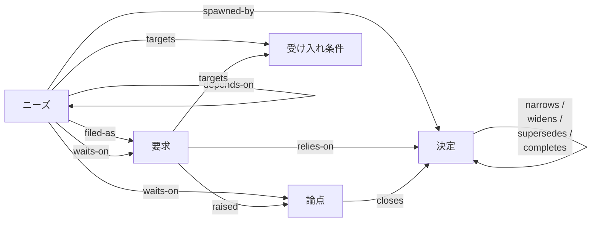

# gy — good,yes

[English](README.md) | 日本語

## gyとは？

gy は自分の仕事を早く終わらせ、早く帰るために「人間がAIに必要な文脈を伝えたり、伝わるように整理したりする雑事」からの解放を目指しています。
具体的には**「ニーズ以降、成果物以前」**の間で発生する大量の文脈を厳密な不変条件と共に、以下のノードとエッジで構成されるグラフとして扱います。



使い方は簡単で、

1. AIにgyを認知させること
   (`gy-loop`というスキルを同梱しているので、"今日からgy-loopに沿って仕事を進めていきたい"と伝えるだけでOK)
2. やりたいこととその必要性を伝える

で以上です。以降は新しいセッションになっても「次は何する？」とAIに声をかければ、次やるべきことを教えてくれます。
詳しい話は後述しますが、gyを使っていて最も効果を感じる瞬間は「自分の過去の決定を覆す時」です。

## 使い方

### インストール

```sh
cargo install gy

# オプショナル(手っ取り早く`gy`をAIに伝えたい場合)
npx skills add aq2bq/gy
```

gy は 1 日 1 回、裏で `cargo info gy` を打ち、crates.io の最新版を調べます。手元より新しければ、`gy handover` と `gy next` が標準エラーに 1 行、更新のコマンドと一緒に知らせます。記録を共有しないかぎり、これ以外の通信はしません。

### gyについて伝える

以下のような文をプロンプトやAGENTS.md/CLAUDE.mdへ書くなりして伝わるようにしておくと、毎回AIエージェントは `gy handover` と `gy next` から続きを再開します。

```
このプロジェクトは gy で進行状態を管理している。何かを始める・再開する前に gy-loop スキルを読み、記録に従う。
```

### gyの記録の本体

記録の本体はデフォルトで`$XDG_DATA_HOME/gy/<リポジトリのルートのハッシュ>/`以下に保存されます。後述するチームでの共有を設定しない限り、gy はネットワークへ出ません。プロジェクトのリポジトリ内に置くのはおすすめできません。というのも「ニーズ以降、成果物以前」の間で起きる変更のサイクルと、成果物の変更のサイクルは全く異なるからです。

### [EXPERIMENTAL] gyをチームで利用する/記録の本体をリモートに置く方法

まだ実験的機能ですが

```shell
gy remote set https://github.com/you/yourproject-gy.git
```

でリモートリポジトリが設定され、以降はバックグラウンドで`gy remote sync`が呼ばれ同期されます。他のメンバーとgyを共有する場合はリポジトリを共有し、相手に`gy remote join`を実行してもらうだけです。

#### EXPERIMENTALについて

- 連休中にこの機能を作ったため、作者はチームで利用したことがない
- 同期のメカニズムが上手くいくかどうか以上に、gyでカバーし得ない規律のようなものがないと上手くいかないのではと予想している

## メンタルモデル: 「プロジェクトのコンテキストをgyに委ね、人間は意思決定に向き合う」

- 再開のたびの説明が要らなくなります。セッションをリセットした後に「現在地はこの Issue、進め方はこのファイル、前回はこの PR まで、次は X」と書くことがなくなります。エージェントは `gy handover` と `gy next` から始めます。
- ニーズを伝える時の「人間がAIへどこまで何を伝えるか」については、詳しく伝えることで「論点」と「受け入れ条件」が早期に出揃う結果につながり、ひとまず「妄想を伝えておく」ということで必要な決定を先送りするという使い方につながります。結局のところ必要な決定の数そのものは変化しません。
- 過去の決定を覆す時に新しい決定は、古い決定のどこが効力を失うかを引用しなければ書けません。印が付くのは引用された一節だけで、残りは効力を持ったままです。矛盾を gy が見つけるわけではありません。着手する作業がその決定ノードとエッジで繋がっていることでAIは有効な決定について理解することができます。

人間に残るのはひたすら決めることです。目的とニーズ、そしてAIが提示する質問や選択肢への回答です。 `gy-loop` の 1 行目も "A person cannot escape the critical decisions. gy frees them from everything else." です。

## 人間用のView: gy serve

記録を自分で見るには `gy serve` を使います。スクショは `scripts/demo-ledger.sh` が作る見本の記録です。自分の記録がまだ無いうちは、これを実行して `gy serve` すると同じものを見られます。

### いま


### グラフ


### ノードの詳細


## 5 種のノードと 12 のエッジ

ノードは 5 種あります。うち 4 種は、仕事の一巡をなぞる環を作ります。決定がニーズを生み、ニーズが要求として立てられ、作業が論点を生み、論点が次の決定として閉じます。残る 1 種の受け入れ条件は、環の外から作業を測ります。

| ノード | ID | 意味 |
| --- | --- | --- |
| ニーズ | `n-…` | やるべき仕事。受け入れ条件を対象にする |
| 論点 | `q-…` | 未決のこと。決定者と 2 つ以上の選択肢を持つ |
| 決定 | `d-…` | 適用範囲を持つ決定 |
| 要求 | `r-…` | 承認を求めて立てたニーズ。外への参照を 1 つ持つ |
| 受け入れ条件 | `ac-…` | 進捗を数える相手 |

エッジは、始まる側のノードだけに保存します。逆向きは導出するので、同じ事実を 2 度書きません。エッジは 12 の関係のいずれかで、関係ごとに許されるノードの組は決まっています。

| 向き | 関係 | 逆向き |
| --- | --- | --- |
| 論点 → 決定 | `closes` | `closed-by` |
| 決定 → 決定 | `narrows`・`widens`・`supersedes`・`completes` | `narrowed-by`・`widened-by`・`superseded-by`・`completed-by` |
| ニーズ・要求 → 受け入れ条件 | `targets` | `targeted-by` |
| ニーズ → 決定 | `spawned-by` | `spawns` |
| ニーズ → 要求 | `filed-as` | `files` |
| ニーズ → ニーズ | `depends-on` | `depended-on-by` |
| 要求 → 決定 | `relies-on` | `relied-on-by` |
| 要求 → 論点 | `raised` | `raised-by` |
| ニーズ → 論点・要求 | `waits-on` | `awaited-by` |

決定は適用範囲とともに保存します。後から読む人が、その決定がどこで成り立ち、どこでは成り立たないかを判断できるようにするためです。`narrows` と `supersedes` では、古い決定のうち効力を失う箇所も指定します。指定した文字列はエッジを書く時点でその決定の本文と照合します。

## 要求の 4 状態と確定

要求の状態は 4 つです。`filed`（提出済み）、`approved`（確定）、`done`（完了）、`cancelled`（中止）。確定・改訂・完了・中止はそれぞれ 1 つのコマンドで、設計を誰から聞いたか、根拠、理由を記録します。それ以外の遷移は拒まれます。

| 遷移元 | 遷移先 | コマンド |
| --- | --- | --- |
| filed | approved | `req approve` |
| approved | filed | `req revise` |
| approved | done | `req done` |
| filed・approved | cancelled | `req cancel` |

確定（approved）は、記録の外の作業の関門です。gy は記録の外で作られたものを見られませんが、その結果を書き留めることは拒みます。`criterion satisfy` は、approved か done の要求がその受け入れ条件を `targets` で指しているときだけ通り、拒むときは次に打つコマンド（`req add …` か `req approve …`）を言います。要求が approved のあいだは、そのタイトル・本文・`targets`・`relies-on` と、それが指す受け入れ条件のタイトル・本文は編集できません。変えるときは先に `req revise` で filed に戻します。誰が承認するかは利用者の方針で、gy は裁きません。同梱の `gy-loop` スキルは、要求を毎回自分で読むか、最初の 1 件だけ読むか、エージェントに任せるかを、エージェントに一度だけ尋ねさせます。

確定より後のことについて gy が持つのは、この 4 つの記録だけです。実装をどこで進めるか、どう設計するか、いつ監査するかは gy の外にあり、要求の ref が指す先に置きます。

## canonical の置き場所

canonical は追記専用のイベントログです。リポジトリに置くのは `gy.toml` だけです。書き込みは 1 回で 1 トランザクションとしてログに追記し、連番・時刻・書き手・理由・出典を残します。その場で書き換えることはありません。

`undo --reason <文>` は直前のトランザクションを逆にたどる新しいトランザクションを追記します。間違いと訂正の両方が履歴に残ります。戻せるのは直前の 1 件だけで、続けて打つと直前の undo 自身を戻します（redo）。ログが canonical で、隣のスナップショットファイルは開くのを速くするだけで、消しても構いません。

## 26 の操作

書きは、記録へ自分のトランザクションを足す操作です。誰がなぜ書いたかが残り、`undo` の対象になります。読みは記録を変えません。どちらでもない操作が 3 つあり、記録の置き場所を決めます。

最初の書き込みの前に (1):

| 操作 | 結果 |
| --- | --- |
| `init <scope>` | ここでリポジトリを始める。gy.toml にスコープを 1 つ書いてから、読むべきスキルと最初に立てるノードを名指しする。既に gy.toml があれば報告だけして触らない |

読み (6):

| 操作 | 結果 |
| --- | --- |
| `show <ID\|ref>... [--full]` | ID・別名・ref でノードを表示し、足りないものも出す |
| `list [--type] [--status] [--targets] [--grep] [--actor] [--since]` | ノードの一覧。`--actor` か `--since` を与えると書き込み単位。種別と状態の綴りは大小を問わず、`--since` は seq か日付（`YYYY-MM-DD`、あなたの場所のその日の 0 時から） |
| `next` | 前提の片付いたニーズ |
| `handover` | 進行中の要求と、再開に要る件数 |
| `publish [--scope] [--out]` | 記録を Markdown の Wiki として書く: スコープごとの入口 `README.md` と、ニーズと決定の 1 件ごとのページ |
| `serve` | 記録をブラウザで読む。127.0.0.1 で（GET だけ、書く経路は無い）、止めるまで。端末から起動したときはブラウザを開く |

記録の置き場所 (3、experimental):

チームで共有するときだけの操作です。`gy.toml` に `remote` を書かなければ 3 つとも使わず、gy は手元だけで動きます。変えるのは記録の履歴の外にあるもので、`remote set` は `gy.toml` を書いて記録を上げ、`remote sync` は commit を push します。旧名の `share` / `join` / `sync` も動きますが deprecated です。`remote` の群を使ってください。

| 操作 | 結果 |
| --- | --- |
| `remote set <URL>` | 共有を始める（experimental）: remote を検査し、`gy.toml` に `remote` を書き、今の記録を上げ、守りと招待の文を出す |
| `remote join` | 参加する（experimental）: 要るものを確かめて直し方を並べ、複製を取り、誰として書くかと次の一手を言う。何度打っても同じ |
| `remote sync` | remote と同期する（experimental）。複製が無ければ取り、未 push の書きを 1 行 1 commit で push し、remote が先なら取り込んで載せ直す。異常時は原因と手段を出す |

書き (16):

| 操作 | 結果 |
| --- | --- |
| `need add "<タイトル>" --targets <AC>... [--spawned-by <D>] [--body-file <path>]` | 受け入れ条件を対象にニーズを立てる |
| `need close <ID> --by fact\|external --evidence <文>` | 要求を経由せずニーズを閉じる |
| `question add "<タイトル>" --decider <名> --options <文>... [--body-file <path>]` | 決定者と 2 つ以上の選択肢を持つ論点を立てる |
| `question close <ID> --by fact\|decision\|non-decision --evidence <文> [--decision <D>]` | 論点を閉じ、決定で閉じる場合は決定も残す |
| `criterion add "<タイトル>" [--body-file <path>]` | 受け入れ条件を追加する |
| `criterion satisfy <AC> --evidence <文> [--revoke]` | 受け入れ条件が成り立つ根拠を記録する。`--revoke` で取り消す |
| `req add "<タイトル>" --need <N>... [--relies-on <D>]... [--targets <AC>]... [--ref <ref>] [--body-file <path>]` | ニーズ・決定・受け入れ条件に対して要求を立てる |
| `req approve <ID\|ref> --design <文> --heard-by <名> --evidence <文>` | 要求の設計を確定する |
| `req revise <ID> --reason <文> --source <文>` | 確定した要求を提出済みへ戻す |
| `req done <ID> --evidence <文>` | 確定した要求が完了したことを記録する |
| `req cancel <ID> --reason <文> --source <文>` | 完了しなかった要求を中止する |
| `decide "<タイトル>" --scope-note <文> [--body-file <path>] [--closes <Q>]... [--relate <関係> <D> --mark <文>] [--source <文>]` | 決定を作り、論点を閉じ、系譜のエッジを 1 つ記録する |
| `link <from> <関係> <to> [--mark <文>] [--remove]` | エッジを 1 つ追加または削除する |
| `edit <ID> --reason <文> [--title] [--body-file] [--set k=v] [--append k=v]` | タイトル・本文・自由属性を変える。自由属性は文字列で、`--set` は上書き、`--set k=` は消去、`--append` は改行区切りで 1 行足す。`--set scope=<名前>` で gy.toml にあるスコープへ移せ、`--set decision_scope=<文>` で未記録の適用範囲を 1 回だけ記録できる |
| `scope rename <旧> <新>` | あるスコープの全ノードを新しい名へ移し、gy.toml をコメントと順序を保ったまま書き換える |
| `undo --reason <文>` | 直前のトランザクションを打ち消す |

書き込みはどれも、変えたもの、そのノードにまだ無いもの、次に打てるコマンドの形を出力します。次の一手は別の手順書を見なくても分かります。ノードを作る書き込み（`need add` / `question add` / `criterion add` / `decide` / `req add`）は、先頭に `id: <ID>` を出します。`--ref` を付けた `req add` では `id: <ID> (<ref>)` になります。`--json` を付けると同じ内容をデータで返すので、ID を機械で取るときはその行ではなく `--json` から読みます。

## 日付と時刻

ノードの `created`、受け入れ条件の `satisfied_at`、要求の記録の日付は UTC の瞬間として保存され、`show` と `list` はあなたの場所（`TZ`）の `YYYY-MM-DD HH:MM` で出します。`--json` は保存の値（`2026-09-18T07:28:56Z`）のままです。チームで時点を指すときは日付ではなく seq か ID を使ってください。

## セッションの再開

新しいセッションは 3 つのコマンドで始めます。`handover` は進行中の要求を ref 付きで示し、開いている論点の数、着手できるニーズの数、エラーと警告の件数を出します。`next` は前提の片付いたニーズを列挙し、エージェントがそのうち 1 つを依頼者（エージェントに仕事を頼む人）へ差し出します。`show` は 1 つのノードを読む。後から走らせる `lint` はありません。不正な書き込みはその場で拒まれ、注意が要る状態は `handover` が件数で出します。

```sh
gy handover
gy next
gy show n-3f9a
```

## gy.toml

設定するのはスコープ名と、必要なら `publish` の出力先、チームで使うなら記録専用の git remote だけです。それ以外のキーがあると、読み込みの時点で拒まれます。表の外のキーは最初の `[scopes.*]` より前に書きます。

`gy.toml` はプロジェクトの git リポジトリのルートに置きます。gy は今いるディレクトリから上へ探し、最初に見つかる `.git` の階層で止まります。そのため、別のリポジトリの中に入れ子になったリポジトリが外側の記録を使うことはありません。

```toml
# 任意。--out を付けないときの publish の出力先。
output = "docs/publication"
# 任意（experimental）。記録専用の git repo。チームで使う節を参照。
remote = "https://github.com/you/yourproject-ledger.git"

[scopes.myproject]
```

読みはすべてのスコープを対象にします。書き込みでスコープが要るのは、ファイルが 2 つ以上のスコープを挙げているときだけです。`--scope <名>` で選びます。最初の書き込みが記録を作り、読みが作ることはありません。

## チームで使う（experimental）

記録は、それ専用の git repo 1 つを canonical にして共有します。構成員は人で、各自が自分のマシンと記録の複製を持ちます。始める人は `gy remote set` を、招かれた人は `gy remote join` を本人が打ち、エージェントはその人の複製に今までどおり書くだけです。同じマシンの複数エージェントは元々ローカル記録を共有していて remote は要りません。手続きは 2 つで、どちらも gy が次の一手を言います。

**共有を始める（単独で使っていた人）**。GitHub に空の private repo を 1 つ作り、プロジェクトの checkout で打ちます。

```sh
gy remote set https://github.com/you/yourproject-ledger.git
```

remote を検査し（空か記録専用か、push できるか）、`gy.toml` に `remote` を書き、今の記録をそのまま上げ、branch protection の付け方（linear history の必須、force push の禁止。gy は設定を変えません）と、メンバーへの招待の文を出します。`gy.toml` はプロジェクトと一緒にコミットします。

この一歩はエージェントではなく、あなたの作業です。`gy remote set` は記録の全体をその repo へ上げます。エージェントの実行環境はこれを外部への送信と見なして拒むことがあり、エージェントは自分にその許可を与えられません。repo を作るのと branch を守るのがあなたの作業であるのと同じく、`gy remote set` もあなたが一度だけ打つか、エージェントの設定で `gy remote set` と `gy remote sync` をあなたが許可してください。その後は、エージェントは今までどおり書き、push は背景で行われます。

**参加する（招待された人）**。記録の repo の write の権限をもらい、プロジェクトを clone して打ちます。

```sh
gy remote join
```

要るもの（git、repo を読める資格、名乗る名前 — `git config user.name` と `user.email`、または `GIT_AUTHOR_NAME` と `GIT_AUTHOR_EMAIL`）を一度に確かめ、足りなければ直し方を並べて止まります。揃っていれば複製を取り、誰として書くことになるか（`user.name / GY_ACTOR`）と次の一手（`gy handover`）を言います。何度打っても同じ状態に落ち着きます。`gy remote join` を打たずに `gy handover` から入っても最初のコマンドが複製を取り、同じ「joined」の 1 行を出します。

**それからの使い方は今までと同じです。**

- 書きは手元に即座に載り、push は背景で行われます（書きの直後と、`gy serve` の起動中は 10 秒ごと）。`gy remote sync` で明示にも同期できます。remote に届かない間も読み書きは通り、戻れば溜まった分がまとめて push されます。
- remote が先に進んでいたら、自分の未 push の書きはその後ろに載せ直されます。同じノードを相手が先に変えていた書きだけが拒まれ、次の gy コマンドの標準エラーと `handover` で本人にだけ知らされます。やり直すかどうかはあなたが決めます。
- 書き手は `user.name / GY_ACTOR` で記録され、`list` と画面にそう出ます。同じエージェント名でも人間が違えば別の書き手です。名前は git がコミットに署名するのと同じもので、git と同じ順（`GIT_AUTHOR_NAME` が先、無ければ `git config user.name`）で決まります。1 回の書きを記録と git の履歴が別々の人の名前で指すことはありません。
- remote は gy だけが書く場所です。1 書き = 1 commit で、履歴が gy 以外に変えられていれば同期が拒んで戻し方を示します。記録以外の内容がある repo は拒みます。
- `gy.toml` の `remote` の行を消せば手元だけの記録に戻ります（次のコマンドが 1 回だけ知らせます）。同じ行を戻すと、止まったところから同期を続け、その間に書いたものもいつもどおり push します。古いコミットを checkout して戻ったときも、これに当たります。別の remote や別の記録とは繋がりません。合流は持ちません。

記録には判断に至るやり取りが入ります。remote に置くということは、その記録が GitHub にある、ということです。

## 書き手

書き込みはどれも `GY_ACTOR` で書き手を名乗ります。未設定か空ならエラーになり、名前は理由と出典と並んで履歴に残ります。

```sh
export GY_ACTOR=leader
```

エージェントは各自の名前で自分の記録を書くので、履歴を見れば誰が何をなぜ変えたかが分かります。

## ID と別名と ref

ID は gy が振ります。種類の接頭辞と短いハッシュで、`n-3f9a` のような形です。ハッシュには少なくとも 1 文字の a〜f が含まれるので、旧 ID と見分けがつきます。中央の採番器を持たないので、2 人のエージェントが同時に書いても衝突せず、衝突すればハッシュが長くなるだけです。`show` は ID の完全一致、別名（0 埋めと大文字小文字は同一視するので `D-8` = `D-08`）、要求の外への参照を、完全一致か末尾一致で受け付けます。

既存の記録は旧 ID を別名として保つので、`show D-164` でも `show '#6027'` でも改名後のノードに届きます。要求の参照（`--ref`）は不透明な値で、gy は保存するだけで、その先を読みません。

## publish

`publish` は、記録を GitHub で読む Markdown の Wiki として書き出します。出力先の下にスコープごとのディレクトリを作り、入口の `README.md` と、ニーズと決定の 1 件ごとのページを置きます。各頂点が届くノード（そのニーズの受け入れ条件・要求・論点）はそのページに全文で展開し、どのニーズも決定も届かないノードは `loose.md` に置くので、スコープの全ノードが全文で読めます。

ページは、フロントマター（`id`、`kind`、ニーズと要求は `state`、`scope`、`created`、関係ごとのエッジ）とタイトルで始まり、入口へ戻る 1 行と本文の節が続きます。取り消された一節はその場で打ち消し線になり、取り消した決定を名指しします。他のスコープのノードはリンクにせず、スコープを添えた平文で書きます。

入口には、未決の論点、作りかけの要求、新しい頂点、決定とニーズの全件を、それぞれ読めるページへのリンクで並べます。読み方の説明も履歴も診断も載せません。2 回目の実行は同じファイルをバイト単位で書きます。

`publish` は常に今の記録を出します。`--since` は互換のために受け取りますが効果は無く、標準エラーに 1 行だけそう言います。`--out` は出力先のディレクトリ、`gy.toml` の `output` は既定の出力先を指定し、どちらも無ければエラーです。対象スコープのディレクトリだけを消して作り直し、`--out` の他のファイルと他のスコープのディレクトリには触りません。

## 開発

```sh
cargo fmt --all -- --check
cargo clippy --workspace --all-targets --locked -- -D warnings
cargo test --workspace --locked
```

ワークスペースは `gy-ledger`（保存・モデル・操作）、`gy-serve`（読み取り専用の Web 表示）、`gy`（CLI）で構成します。CI は Linux で検証し、他のプラットフォームは未検証です。`gy serve` の画面には `e2e/`（Playwright、chromium）の E2E があり、[e2e/README.md](e2e/README.md) を読みます。`cargo test` には入りません。
