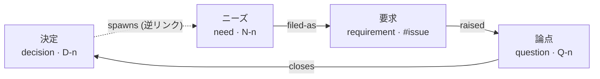
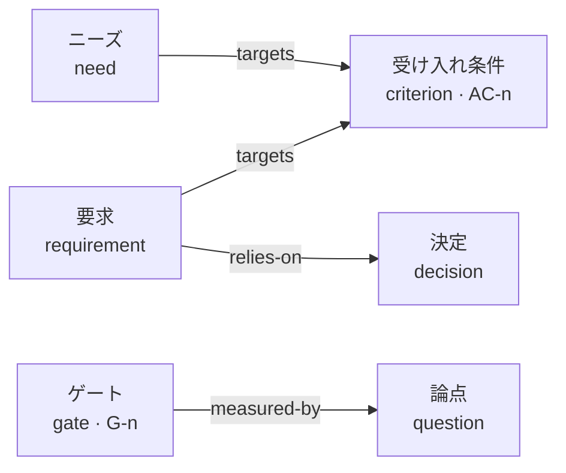
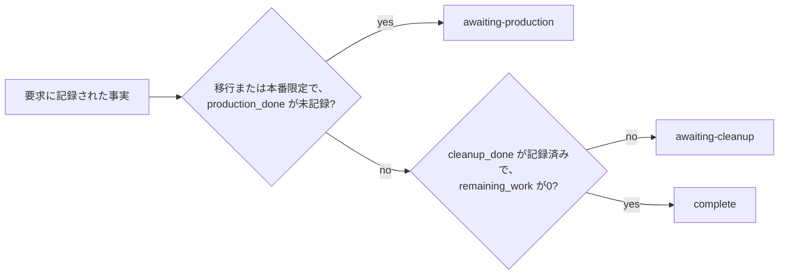

# gy — good,yes

[English](README.md) | 日本語

決定・論点・ニーズ・要求・受け入れ条件・継続判断ゲートを、Markdown ファイルのグラフとして管理する Rust 製の CLI です。エージェントは CLI か MCP から書き、人間は `render` が生成する台帳と `show` の記録を読みます。

`lint` が検査するのは、グラフの内側の整合だけです。台帳がコード・GitHub・本番と一致しているかは、利用者が確かめます。gy は GitHub API を呼びません。

## 終盤に何が起きるか

エージェントに任せた仕事は、順調なあいだは読まなくて済みます。読まなくて済むので、読まなくなります。どこまでうまく進むかは、文脈に入る量、対象の規模、モデルの性能に依存しているのですが、その依存は順調なうちは目に見えません。

見えるようになるのは終盤です。要求を完了と宣言する場面。以前の作業が依拠した決定が、いつのまにか差し替わっている場面。残った作業をどこかへ移す場面。そして、責任を負う一人が複数のプロジェクトを同時に抱え、そのすべてを読めない場面です。四つとも、順調なあいだは起きません。起きたときには、何に基づいて進めてきたかを覚えている人がいません。

gy はその終盤のためにあります。計画は持ちません。各作業が何に基づいたか、完了と呼ぶ前に何が成り立っていなければならないかを記録し、記録どうしが矛盾している箇所を報告します。決定は適用条件なしには記録できません。論点は誰の合意で閉じるかを示さずには立てられません。要求は、設計からの逸脱と残作業の行き先を書かずには `complete` に到達できません。

## ADR と課題管理で足りないのか

ここまで読んで、それはもうある道具の仕事ではないかと思った人は、半分正しいです。

- **決定をチームに読ませたい。** ADR ツールの仕事です。gy はすべての記録に必須項目を課し、グラフの整合を保ちます。履歴を読みたいだけの相手には、どちらも邪魔になります。
- **次に何へ着手するかを決めたい。** 「何が解除され、誰が掴んだか」は課題管理の問いです。`next` は前提の解けたニーズを列挙するだけで、割り当ても日程も扱いません。
- **実態を確かめたい。** gy は GitHub API を呼ばず、URL を取得せず、テストを実行せず、承認者を認証しません。台帳にある外部の事実は、すべて人間かエージェントが報告したものです。gy が検査するのは、その報告どうしが整合しているかだけです。

残りの半分は、この三つのどれにも収まらない場面です。複数のプロジェクトが並行し、作業はエージェントに委譲され、一人がそのすべてを読まずにすべての責任を負う。そのとき、gy は費用に見合います。

## 台帳の形

ノードは6種あります。そのうち4種が環をなしていて、この環が gy の存在理由です。決定が新しいニーズを生み、ニーズが起票されて要求になり、作業が新しい論点を生み、論点が次の決定として閉じます。記録が破綻するのはノードの内側ではありません。ノードとノードのあいだです。



箱に併記した英語は `type` 属性の値、辺のラベルは `link` に渡す語で、どちらも翻訳せずそのまま使います。点線の1辺だけは、環が順方向に読めるよう逆リンク名で描いています。`link` に渡す正式なラベルは `spawned-by` で、向きはニーズから決定です。

残る2種は流れに参加しません。流れの外から測ります。受け入れ条件は進捗を数える相手であり、ゲートは方式そのものを続けるかを判断します。



同じ種類のなかで閉じる関連が2つあり、図からは外しました。決定から決定へは系譜（`narrows` / `widens` / `supersedes` / `completes`）、ニーズからニーズへは着手順序（`depends-on`）です。12ラベルすべての向きと逆リンク属性名は[属性と関連](#属性と関連)にまとめてあります。

## 最初の台帳を作る

crates.io からインストールし、スコープを1つ切って、受け入れ条件・ニーズ・論点・決定を1件ずつ置いてみます。

```sh
cargo install gy --locked
gy init demo --parent-issue 6000
gy criterion add "再送時に重複配信しない" --scope demo
gy need add "再送を安全にする" --targets AC-1 --scope demo
gy question add "配信順序をどう決めるか" \
  --decider master --options "発行時刻順" --options "受信順" --scope demo
gy decide "配信順序を発行時刻順に固定する" \
  --closes Q-1 --scope-note "本番ワーカーに適用。バッチ再送は対象外" --scope demo
gy lint
gy render
```

この例の `gy lint` は何も報告しません。決定には成立範囲があり、論点には決定者と2つの選択肢があり、ニーズは受け入れ条件を担っているからです。試しに `--scope-note` を落として `decide` を実行すると、記録される前に CLI が拒否します。あとから広く適用されすぎる決定を、書いた時点で止めるためです。

`init` は `.gy-dir`、`docs/ledger/gy.toml`、スコープのディレクトリを作り、既存の `AGENTS.md` に台帳の案内を追記します。以後のコマンドはサブディレクトリからでも台帳を見つけます。読み取りは全スコープが対象で、スコープが要るのは書き込みだけです。新しいノードを作るときはスコープのディレクトリ内で実行するか `--scope` を渡し、既存 ID を更新するコマンドはその ID のスコープへ書きます。スコープ名を変えたくなったら `gy scope rename <old> <new>` です。ディレクトリ・所属ノード・設定をまとめて改名し、ノード ID・関連・記録・履歴はそのまま残ります。

ソースから入れるなら、チェックアウト先で `cargo install --path crates/gy --locked` を実行します。

## コマンド

| コマンド | 結果 |
| --- | --- |
| `init <scope>` | 台帳とスコープを作成 |
| `scope rename <old> <new>` | スコープを改名。ノード ID・関連・記録・履歴を維持 |
| `need add` / `need file` | 受け入れ条件を担うニーズを作成し、要求へ関連付け |
| `question add` / `question close` | 横断検索のうえで論点を登録し、3通りのいずれかで閉じる |
| `q "一文"` | 人間用の短縮メモ。必須情報を補うまで lint が失敗 |
| `decide` | 成立範囲付きの決定を作成し、指定した論点を閉じる |
| `link <source> <label> <target>` | 両側の frontmatter に関連を記録 |
| `req add` / `req advance` | 要求の登録と、根拠付きの状態遷移 |
| `req compress <issue>` | 制約が決定へ移ったことを検査し、全文を退避したうえで6項目へ圧縮 |
| `criterion add` / `criterion satisfy` | 受け入れ条件を作成し、充足の根拠を記録 |
| `gate add` | 継続判断ゲートを作成 |
| `node set` / `node submit` | 任意属性や本文を更新。設定した様式で記録を検査して提出 |
| `find` / `show` | 属性・本文の検索。ノードと両側の関連の表示 |
| `next` | 前提の解けたニーズを列挙 |
| `lint` / `handover` | 整合性と、引き継ぎに要る記録の検査 |
| `stats` | 受け入れ条件の充足数と、git 履歴による論点の発生率 |
| `render` | 分割された Markdown・DOT・単一 HTML を生成 |
| `import <directory>` | ADR を ID を保って取り込み |
| `cheatsheet` / `completions <shell>` | 操作早見表とシェル補完 |
| `skills install <dir>` / `mcp serve` | エージェント向け手順の展開と MCP サーバ |

全コマンドに `--json`、`--quiet`、`--verbose`、`-C <dir>`、`--scope` を指定できます。`--json` は結果を標準出力へ、診断を標準エラーへ JSON で返します。`--quiet` は通常の結果表示を抑え、JSON の結果とエラーは残します。

変更系のコマンドは、変更したノードの要約だけを返します。要約は `id`・`type`・`scope`・`changed_attributes`・`body_changed` で、属性値・本文・evidence は含みません。`changed_attributes` は実際の変更を表し、作成時は全属性名、更新時は削除した属性名も含み、同値の再設定なら `[]` と `false` です。全属性と本文は `gy show <ID> --json` で、検索は `gy find` で取ります。CLI の JSON と MCP の構造化結果は同じ形です。

終了コードは 0 が成功、1 が検査失敗、2 が入力不足・参照先不在・ガード違反、3 が台帳のパース失敗や不整合です。`handover` は、次遷移の根拠や責任主体の不足、参照先の不在でも 1 を返します。

## 属性と関連

frontmatter の必須属性は `id`、`type`、`title`、`scope`、`created` の5つです。知らない属性があっても、読み書きのあとに残ります。値は `node set --set key=value` で設定でき、JSON として解析できる値は配列・数値・真偽値・オブジェクトとして保存します。

```sh
gy node set N-1 --set 'waiting-on=["Q-2"]' --set 'custom={"region":"east"}'
gy find --where custom.region=east
gy find 配信 --where type=decision --where 'created>=2026-09-01'
gy node set D-1 --body-file decision-body.md
```

検索演算子は `=`、`!=`、`>=`、`<=`、`>`、`<`、`~`（部分一致）です。数値どうしは数値として、それ以外は文字列として比較します。ISO 形式の日付は文字列比較で時系列順になります。検索結果には Context、Decision、成立範囲のうちヒットした箇所が表示されます。

| 属性 | 対象・意味 |
| --- | --- |
| `decision_scope` | 決定の成立範囲。作成時は `--scope-note` で渡す |
| `decider` / `options` | 論点の決定者と、互いに異なる選択肢の配列 |
| `bundle` / `bundle-rationale` | 論点の束と、同じ手当てで閉じる理由 |
| `waiting-on` / `unresolved` | 未決として参照する ID の配列 |
| `raised-by` | 論点が生じた要求。複数の要求を許す |
| `belongs-to` | 論点の所有ノード ID の配列。所有者が2件以上あると L4 が検出 |
| `bearer_count` | 受け入れ条件の担い手数。`targets` の実数と比較 |
| `parent_issue` | 確認済みの親 Issue 番号。設定値と比較 |
| `status` | 要求の11状態、論点の `open` / `closed` |
| `pr_url` / `pr_base` / `pr_files` | 要求に記録した PR の URL・base・変更ファイル数 |
| `remaining_work` | 従来の残作業件数または配列。残っていれば `residual` との矛盾を検査 |
| `summary` / `contracts_changed` | 達成したことの1文と、変更した契約の自由記述または一覧 |
| `artifacts` | `pr`・`merge_commit`・`base_branch`。成果物を辿るための記録 |
| `production` | 本番の実測値・確認結果のオブジェクト。本番作業がなければ `none` |
| `deviations` / `residual` | 逸脱と追加判断、残作業の移管先。なければそれぞれ `none` |
| `compressed` / `compressed_from` | 圧縮日と退避先の Issue コメント URL。6項目には数えない |
| `next_evidence` / `responsible` | 進行中の要求の、次遷移の根拠と責任主体 |
| `constraints` | 後続が引く制約の配列。各要素は `text` と `decision` |
| `constraints_reviewed` | 制約を1件ずつ確認した記録 |
| `satisfied` / `satisfied_at` | 受け入れ条件の充足と記録日時 |

関連の向きと逆側の属性名は次のとおりです。`link` は両側へ保存し、`lint` は対称性と型を検査します。

| 向き | ラベル | 逆側の属性 |
| --- | --- | --- |
| question → decision | `closes` | `closes` |
| decision → decision | `narrows` / `widens` / `supersedes` / `completes` | `narrowed-by` / `widened-by` / `superseded-by` / `completed-by` |
| need / requirement → criterion | `targets` | `targeted-by` |
| need → decision | `spawned-by` | `spawns` |
| need → requirement | `filed-as` | `filed-from` |
| need → need | `depends-on` | `needed-by` |
| requirement → decision | `relies-on` | `relied-on-by` |
| requirement → question | `raised` | `raised-by` |
| gate → question | `measured-by` | `measures` |

`narrows` と `supersedes` では、`--mark` に古い決定の本文のうち効力を失う箇所を指定します。本文そのものは変えず、`show` と `render` が表示時に印を付けます。指定した文字列が本文に見つからなければ別記するので、印が黙って別の箇所へ移ることはありません。

## 要求はどのように complete へ至るか

要求には11の状態があります。表にすると順に登る階段に見えますが、gy は状態のあいだの順序を検査しません。各状態にはその状態自身のガードがあり、ガードを満たすかぎり、11状態のどこからどこへでも、前へも後ろへも移せます。代わりにすべての遷移に `--evidence` が要り、遷移元・遷移先・時刻とともに `transitions` の履歴へ追記されます。CLI・生成文書・同梱の手順は英語で、状態値も英語です。

| 意味 | 状態値 |
| --- | --- |
| 未起票 | `unfiled` |
| 要求化中 | `defining` |
| 設計待ち | `awaiting-design` |
| 承認待ち | `awaiting-approval` |
| 実装待ち | `awaiting-implementation` |
| 監査待ち | `awaiting-audit` |
| PR 待ち | `awaiting-pr` |
| マージ待ち | `awaiting-merge` |
| 本番作業待ち | `awaiting-production` |
| 後始末待ち | `awaiting-cleanup` |
| 完了 | `complete` |

`awaiting-implementation (phase 2)` のように、括弧で補足を添えられます。旧実装の日本語の状態値で書かれた台帳は、状態値と明示的な「なし」の値を英語へ直してから使います。gy は自動では移行しません。

```sh
gy req add "再送制御" --issue 6006 --parent-issue 6000 --scope demo
gy need file N-1 --issue 6006
gy node set '#6006' --set pr_url=https://github.com/org/repo/pull/6007 \
  --set pr_base=main --set pr_files=3
gy req advance 6006 --to awaiting-merge --evidence "PR の差分を確認した記録" \
  --reported-base main --reported-files 3
```

`--reported-base` と `--reported-files` は、利用者が確認してきた値です。gy はこれを frontmatter と照合するだけで、PR の実在も差分も問い合わせません。

状態のあいだに順序はありませんが、末尾の3状態だけは例外です。この3つは利用者が選ぶものではありません。`awaiting-production` / `awaiting-cleanup` / `complete` へ進めるときは `--data-migration true|false` と `--production-only true|false` を報告し、記録された事実からどれが許されるかを gy が計算します。違う状態を指定すると拒否されます。



完了には `--cleanup-done true` と、行き先の決まっていない残作業がないことが要ります。完了した要求には `deviations` と `residual` を明記します。`residual` は `none` か、実在する移管先の `N-xx` / `Q-xx` / `#Issue` です。`remaining_work` が残っているなら、0 か空配列でなければなりません。

```sh
gy node set '#6006' --set remaining_work=0 --set deviations=none --set residual=none
gy req advance 6006 --to complete --evidence "残作業一覧を確認" \
  --data-migration false --production-only false --cleanup-done true
```

## 完了した要求を圧縮する

完了した要求は、そのままだと遷移の履歴、PR の情報、制約の一覧を抱えたまま台帳に残ります。後続が読みたいのは、何を達成し、どの契約を変え、成果物がどこにあり、本番で何を確かめ、設計から何を逸脱し、何を残したか、の6項目です。`req compress` はこの6項目だけを残し、それ以外を Issue のコメントへ退避します。

退避まで gy がやってくれると思うかもしれません。やりません。gy は GitHub へ書かないので、手順は往復になります。gy が全文を出力し、利用者がそれを Issue のコメントへ貼り、そのコメントの URL を gy へ渡す。この往復のあいだ、全文が本当に退避できたかを知っているのは利用者だけです。

先に、要求が抱える `constraints` を1件ずつ、成立範囲のある決定へ対応付けて `relies-on` を張ります。`constraints_reviewed=true` は利用者が確認したという記録で、制約が本文に書き漏れていないかまでは gy は判定しません。そのうえで6項目を frontmatter に書きます。`summary` は要求のタイトルとは別に、達成したことを1文・1行で書きます。`contracts_changed` は自由記述で、プロジェクト固有の品質ゲート表との対応は正規化しません。

```sh
gy node set '#6006' \
  --set 'summary=注文明細の重複を一意制約で防止した。' \
  --set 'contracts_changed=["orders.order_lines (UNIQUE制約追加)","POST /api/v1/orders (409応答を追加)"]' \
  --set 'artifacts={"pr":"https://github.com/org/repo/pull/6007","merge_commit":"a1b2c3d","base_branch":"main"}' \
  --set 'production={"migration_total":12431,"migration_updated":87,"migration_remaining":0,"verified_env":"production","verified_at":"2026-09-09"}' \
  --set deviations=none --set residual=none
gy node set '#6006' \
  --set 'constraints=[{"text":"注文明細の重複を防ぐ","decision":"D-1"}]' \
  --set constraints_reviewed=true
gy link '#6006' relies-on D-1
gy req compress 6006 > archive.md
```

`archive.md` の全文を Issue のコメントへ貼り、その URL を渡します。退避後に元の要求を編集したら、最新の全文を退避し直します。

```sh
gy req compress 6006 \
  --evidence 'https://github.com/org/repo/issues/6006#issuecomment-123'
gy find --where 'contracts_changed~orders.order_lines'
```

`--evidence` なしの実行は記録を変えず、検査したうえで元ファイルの全文を出力します。`--evidence` 付きでも圧縮前の全文を標準出力へ返し、そのうえで本文を6項目に置き換えます。`--json` では `archive` に全文、`node` に圧縮後の記録が入ります。退避先 URL を伴う更新では、制約と6項目をもう一度検査します。

圧縮後も ID、`created` を含む必須属性、双方向の辺、知らない属性は残ります。6項目は検索できる属性として保持され、`show` / `render` はそこから本文を生成します。受け入れ条件などの関連は本文へ重複させません。要求から直接 `targets` を張った場合も逆リンクは保存され、L2 の担い手数にはニーズだけを数えます。

圧縮で削除する既知の属性は `constraints`、`constraints_reviewed`、`remaining_work`、`transitions`、`record_history`、`next_evidence`、`responsible`、`pr_url`、`pr_base`、`pr_files`、`data_migration`、`production_only`、`production_done`、`cleanup_done`、`evidence`、`quality_gates`、`design_proposal`、`audit_records` です。これらと元の本文は退避先に残ります。他の拡張属性は保持します。圧縮済みの記録をもう一度圧縮して、元の退避先を上書きすることはできません。

残作業を移管した場合は、`residual=[{"id":"N-2","note":"性能改善を移管"},"Q-3","#6010"]` のように書きます。各移管先は実在するノードでなければなりません。空欄・null・空配列は `none` とは別物で、L11 が検出します。

## lint と render の設定

```toml
# docs/ledger/gy.toml
parent_issue = 6000

[scopes.demo]
parent_issue = 6000

[lint]
L1 = "error"
L6 = "warn"
L2 = { enabled = true, severity = "error" }
# false または "off" で個別に無効化

[render]
output = "{scope}/README.md"
split_threshold = 100
# HTML の出力先。台帳ルート直下（既定）または {scope} ごと
html_output = "gy.html"
```

| 規則 | 検査 |
| --- | --- |
| L1 | 閉じた論点が未決として参照されたまま |
| L2 | 宣言した担い手数が、実際に担うニーズの数と違う |
| L3 | 受け入れ条件のないニーズ |
| L4 | 所有者が複数ある論点 |
| L5 | 置き換えられた決定に依拠したままの未完了要求 |
| L6 | narrows / supersedes の対象箇所に印がない |
| L7 | 成立範囲のない決定 |
| L8 | 決定者のない論点 |
| L9 | 互いに異なる選択肢が2つ未満の論点 |
| L10 | 許された集合の外にある要求の状態 |
| L11 | 完了・圧縮の記録の欠落または不整合 |
| L12 | 理由のない論点の束 |
| L13 | 存在しないノードへの参照 |
| L14 | 取り込み由来で成立範囲のない決定 |

既定は L6 と L14 が warn、それ以外が error です。表の外に `edges` があり、逆リンク・辺の型・mark の一致を検査します。短縮入力 `q` で作った不完全な論点は、L8 / L9 の設定にかかわらず、不足を error として報告します。

どの規則も frontmatter の明示的な記録だけを根拠にします。L1 は `waiting-on` / `unresolved` を、L2 は任意の非負整数 `bearer_count` と `targets` を見て、本文の語から宣言を推測しません。本文にしか書かれていない宣言は、根拠を確かめたうえで属性へ移してください。

`relies-on` は要求が完了したあとも残ります。その要求が何に依拠したかの履歴だからです。L5 が見るのは未完了要求の現在の依存で、完了済み要求の失効した依拠先は `show` と `handover` の `historical_superseded_dependencies` に履歴として出ます。要求を再開すれば、また現在の依存として検査されます。欠けたリンク・逆リンク・完了記録の不備は、完了後も検査します。履歴へ分類されたことは、実態を確認済みだという意味ではありません。正本・ライフサイクル・各規則の判定根拠は[設計上の定義](docs/architecture.md)にあります。

`render` はスコープごとに指定ノード数で分割し、複数ページになれば README に索引を作ります。出力先は台帳内の相対パスで、正本のノードディレクトリには出力できません。

`stats --days 7` は、直近7日とその前の7日について、論点の新規発生数・1日あたりの率・変化量を返します。git の全 ref で ID ごとの最初の追加を数え、本文の編集は新規発生に含めません。未コミットの論点は対象外です。前の期間が0件なら、減衰割合は算出せず null を返します。

## HTML で台帳を読む

`render --format html` は、自己完結した1つの HTML ファイルを生成します。台帳の全データと、`lint` / `next` / `handover` / `stats` が返す判断を埋め込み、ネットワークへ一切出ないので、`file://` で開いてそのまま動きます。

開くと最初の1画面に、充足度・状態分布・未決数・lint 件数が並びます。件数から対応する一覧や Blockers の診断へ飛べます。その下が一覧表で、ここが主な読み取り領域です。タイトルは全文を折り返し、行のどこをクリックしても詳細が開きます。列の並べ替えを含む表示状態は URL の hash に載るので、ID で直接到達でき、ブラウザの戻るも効きます。

グラフは一覧表の下にあり、表示対象の件数で2つの見え方を切り替えます。件数が多いときは、スコープと種別のクラスタを、クラスタ間の集約辺（本数付き）とともに描きます。クラスタをクリックすると、一覧表がそのスコープと種別で絞り込まれます。件数が少ないときは個々のノードを、接続を反映した配置で描きます。近傍のホップ数は、個別表示の上限に収まるよう起点ごとに自動で選びます。決定は `narrows` / `widens` / `supersedes` / `completes` を世代方向に並べた系譜として読め、置き換えられた決定には印が付きます。本文はグラフには描かず、詳細パネルで読みます。

ノードや一覧の行をクリックしても、焦点・絞り込み・配置は動きません。詳細が開くだけです。焦点を移すのは近傍表示のボタンで、**↶** が1段、経路のクリックが複数段戻ります。**All** は絞り込みと系譜を保ったまま焦点を解除し、**Reset all** はそれらも解除して一覧の並べ替えを既定に戻します。詳細パネルには型・スコープ・状態・充足・閉じ方・置き換えがバッジで並び、成立範囲と本文は別々の読み物の領域に置かれます。mark は本文の一致箇所に注記され、見つからない mark は別に表示されて、別の文へは移りません。追加属性は `false`・`0`・`null` を含めて値を全文保持します。HTTP(S) のリンクは利用者が辿るときだけ開きます。

`html_output` は既定で台帳ルート直下の `gy.html` です。`{scope}` を書いたときだけスコープごとに分割します。`split_threshold` は HTML には適用されず、lint の結果は終了コードを変えません。既存の HTML は `gy render --format html` で再生成すれば新しい振る舞いになります。台帳データの移行はなく、再生成は何度実行しても派生 HTML を置き換えるだけで、台帳の記録は変えません。グラフの配置・フィット・ラベルの寸法の規則は [docs/architecture.md の HTML projection](docs/architecture.md#html-projection) にあります。

`init` は、既定の HTML 出力（`html_output`、既定 `gy.html`）を台帳ルートの `.gitignore` へ追記します。既存の `.gitignore` は上書きせず追記だけで、`init` を再実行しても行は重複しません。この機能より前に作った台帳では、既存スコープ名で `gy init <scope>` を再実行するか、`html_output` の値を手で1行足します。再実行は追記のみで冪等ですし、ノード・関連・記録・履歴も保たれます。ただし `gy.toml` は正規化した形で書き直され、設定の値は保たれますが、コメントと書式は失われます（インラインのテーブル書きが `[table]` 節へ展開されるなど）。`gy.toml` に運用のメモをコメントで残しているなら、`init` を再実行せず、`.gitignore` へ手で1行足すほうが安全です。

## 記録様式と遷移ガード

`gy.toml` の `[workflow.records]` に記録の型・必須項目・空欄や「該当なし」の扱いを、`[workflow.guards]` に状態ごとに必要な記録と記録間の照合を設定できます。設定していない台帳には、新しい必須項目は増えません。

`gy node set` で記録を書き、`gy node submit <ID> --record <name> --evidence <根拠>` で検査して提出します。提出は状態を変えず、検査した値・様式・根拠を `record_history` に保存します。`gy req advance` は遷移先のガードを検査し、通れば `transitions[].workflow` に検査時の記録を保存します。不足は `gy lint` の `workflow` 診断に出て、`gy handover --json` には有効な様式とガードも含まれます。判定対象は報告された記録の整合で、URL 先の実在・実際の PR 差分・テスト結果・承認者が人間かどうかは確かめません。

同梱の設定例は、設計の省略にも承認者・対象版・理由・停止条件を求めます。通常の設計改訂は経路を変えずに版を更新し、新しい版への承認を要します。品質ゲートの検査は、失敗・実行不能・既存違反も区別して記録させるもので、全件成功を要求する設定ではありません。通過だけを許す運用では、許可する結果を設定で限定してください。設計の時点で名前が確定しないファイルは `matches-declared-files` で、固定ディレクトリ・ファイル名の接頭辞と接尾辞・生成部分の文字種と長さを宣言し、各宣言と報告ファイルが1対1で対応することを検査します。母数の概念がないゲートは `passed-without-population` で記録でき、`passed` の母数必須は変わりません。

既存の利用者は、自分の設定と過去の記録を保ったまま、台帳の `gy.toml` に新しい variant を足します。[詳しい手順](docs/workflows.md)、[設定例](crates/gy/examples/workflow.toml)、[対応する架空の記録例](crates/gy/examples/workflow-records.json)、[0.4 の移行手順](docs/migration-0.4.md)、[母数のあるゲートとないゲートの使い分け](docs/workflows.md#quality-gates-with-and-without-a-population)を参照してください。現在の設定が適用されるのは、未完了の作業と新たな遷移・提出です。完了済み要求に新しい様式を遡って要求することはなく、保存済みの履歴は当時の様式・照合条件で検査します。

## 既存の ADR を取り込む

`gy import docs/adr --scope demo` は、ID・本文・既存の frontmatter 属性を保って取り込みます。ADR には決定の成立範囲が本文の一節として書かれていることが多いので、その節名を `gy.toml` に指定しておくと `decision_scope` へコピーされます。

```toml
[import]
scope_note_section = "成立範囲"
scope_note_placeholders = ["（移行時に明示されていない）"]
```

対象は `## 成立範囲` のような ATX 見出しで、下位の節を含み、同じ階層か上位の見出しで終わります。コードフェンス内の見出しは無視し、同名の見出しが複数あれば曖昧として取り込みを拒否します。既存の空でない `decision_scope` は維持します。節がない・空欄・設定した定型文だけ、の場合は属性を補完せず L14 に残ります。定型文は前後の空白を除いた完全一致で比べます。成立範囲として意味が通る文かどうかは、人間とエージェントが確かめてください。

結果の `import_summary` に、成立範囲が欠けた件数と ID、mark が欠けた件数と関連が入り、終了時の警告にも件数が出ます。不足があっても取り込みは完了するので、そのあと `gy lint` で確かめます。

frontmatter から取り込んだ `narrows` / `supersedes` の関連には `imported: true` が付き、L6 はその mark 不足を移行由来として表示します。重大度は変わりません。古い決定を読んで `gy link <新ID> <関連> <旧ID> --mark "<対象記述>"` を実行すると両側が更新され、その関連の移行由来の印は通常の操作に置き換わります。import は本文中のリンクから関連や mark を推測しません。

`import` が作る決定ノードにも、`decision_scope` が埋まったかどうかに関わらず node 属性 `imported: true` が付きます。取り込み由来で成立範囲が空の決定は L7 ではなく L14 として報告されるので、成立範囲を意図して空欄のまま取り込んだ旧台帳が `gy lint` と `gy handover` を赤くし続けることはありません。L14 の既定は `warn` で、他の規則と同じく `[lint] L14 = "error"` や `L14 = false` で設定できます。`gy node set` で `decision_scope` を設定すると指摘は消えます。

gy 0.4.0 以前に取り込んだ決定には node の印が無いため、成立範囲が空のままなら従来どおり L7 が error として残ります。`gy lint --json` から L7 の ID を集め、取り込み由来の決定に印を付けます: `gy node set <ID> --set imported=true`。印を付けるのはその台帳が取り込んだ決定だけにしてください。`gy decide` で作って成立範囲を空のままにした決定は新規の作業で、L7 が正しい指摘です。

## MCP と同梱 skills

```sh
gy skills install .agents/skills
npx skills add aq2bq/gy
gy mcp serve
```

MCP は標準入出力で JSON-RPC メッセージを1行ずつ交換します。クライアントには `gy` を、引数 `mcp serve -C /absolute/project/path` とともに設定します。公開するツールは `gy_find`、`gy_show`、`gy_question`、`gy_decide` など19個で、各ツールの `args` は CLI の対応コマンド以降の引数配列です。`gy_find` なら `{"args":["配信","--where","type=decision"]}` です。

同梱する skill は `gy-ledger`、`gy-question`、`gy-decide` の3つです。インストール先の skill が編集されていれば上書きせず、別の出力先を求めます。

`gy skills install` はインストール済みバイナリに埋め込まれた skill を書き出すので、本文は常に手元の gy の版と一致します。出力先の指定が要ります。同梱 skill は標準の `SKILL.md` 形式なので、`npx skills add aq2bq/gy` でも入ります。こちらはバイナリではなくリポジトリから取得します。エージェント検出・project/global・symlink 更新が欲しければ `npx skills`、オフラインで版を固定したいなら `gy skills install` です。

## 開発と配布の検証

HTML の焦点状態とフィットの回帰テストは `node --test tests/html_navigation.test.cjs` で実行します。Node.js が要るのはこの開発用テストだけで、gy のビルドや HTML 生成には要りません。ブラウザでの操作と当たり判定は Playwright で検証します。

```sh
cd e2e
npm ci
npx playwright install --with-deps chromium
npm test
```

この手順はローカルの CLI をビルドし、公開できる合成台帳を生成します。CI の独立した HTML E2E ジョブは、Chromium で既知欠陥の注入を含む検証を毎回実行します。これらの開発依存は両方の Rust クレートの外にあり、生成 HTML は単一ファイルのままです。性能測定の範囲と、欠陥注入後の失敗で検出力を確かめる方法は [e2e/README.md](e2e/README.md) にあります。

```sh
cargo fmt --all -- --check
cargo clippy --workspace --all-targets --locked -- -D warnings
cargo test --workspace --locked
cargo package --workspace --allow-dirty
cargo install --path crates/gy --locked --root target/install-check
```

`gy-core` が保存・操作・検査・表示を提供し、`gy` が clap の CLI と MCP を提供します。読み書きの両方で台帳単位のファイルロックを取ります。複数ファイルの更新は、スコープ改名時のディレクトリ削除を含めて適用前に記録し、途中で止まっても次の起動で完了させます。`.gy-ids.json` は削除済み番号の再利用を防ぐ採番記録なので、台帳と一緒に git へ入れます。`.gy.lock` は入れません。

CI は Linux でテストとインストール確認を行います。他のプラットフォームは検証していません。pre-commit 用のエントリは [.pre-commit-hooks.yaml](.pre-commit-hooks.yaml) です。
