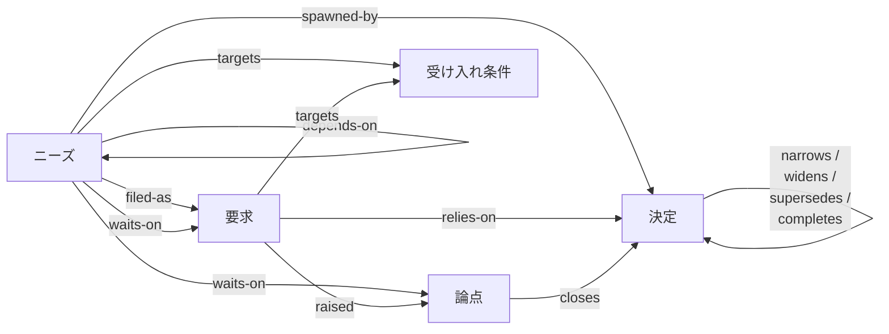

# gy — good,yes

[English](README.md) | 日本語

## gyとは？

gy は自分の仕事を早く終わらせ、早く帰るために「人間がAIに必要な文脈を伝えたり、伝わるように整理したりする雑事」からの解放を目指しています。
具体的には**「ニーズ以降、成果物以前」**の間で発生する大量の文脈を厳密な不変条件と共に、以下のノードとエッジで構成されるグラフとして扱います。


```mermaid
flowchart LR
  N[ニーズ]
  Q[論点]
  D[決定]
  R[要求]
  AC[受け入れ条件]
  N -- spawned-by --> D
  N -- filed-as --> R
  N -- waits-on --> Q
  N -- waits-on --> R
  N -- depends-on --> N
  N -- targets --> AC
  R -- targets --> AC
  R -- relies-on --> D
  R -- raised --> Q
  Q -- closes --> D
  D -- "narrows /<br> widens /<br> supersedes /<br> completes" --> D
```

使い方は簡単で、

1. AIにgyを認知させること
   (`gy-loop`というスキルを同梱しているので、"今日からgy-loopに沿って仕事を進めていきたい"と伝えるだけでOK)
2. やりたいこととその必要性を伝える

で以上です。以降は新しいセッションになっても「次は何する？」とAIに声をかければ、次やるべきことを教えてくれます。
詳しい話は後述しますが、gyを使っていて最も効果を感じる瞬間は「自分の過去の決定を覆す時」です。

## 使い方

### インストール

```sh
cargo install gy

# オプショナル(手っ取り早く`gy`をAIに伝えたい場合)
npx skills add aq2bq/gy
```

gyは1日1回`cargo info gy`で新しい版を調べ、あれば`gy handover`と`gy next`が知らせます。チームで共有しない限り、gyの通信はこれだけです。

### gyについて伝える

以下のような文をプロンプトやAGENTS.md/CLAUDE.mdへ書くなりして伝わるようにしておくと、毎回AIエージェントは `gy handover` と `gy next` から続きを再開します。

```
このプロジェクトは gy で進行状態を管理している。何かを始める・再開する前に gy-loop スキルを読み、記録に従う。
```

### gyの記録の本体

記録の本体はデフォルトで`$XDG_DATA_HOME/gy/<リポジトリのルートのハッシュ>/`以下に保存されます。後述するチームでの共有を設定しない限り、gy はネットワークへ出ません。プロジェクトのリポジトリ内に置くのはおすすめできません。というのも「ニーズ以降、成果物以前」の間で起きる変更のサイクルと、成果物の変更のサイクルは全く異なるからです。

### [EXPERIMENTAL] gyをチームで利用する/記録の本体をリモートに置く方法

まだ実験的機能ですが

```shell
gy remote set https://github.com/you/yourproject-gy.git
```

でリモートリポジトリが設定され、以降はバックグラウンドで`gy remote sync`が呼ばれ同期されます。他のメンバーとgyを共有する場合はリポジトリを共有し、相手に`gy remote join`を実行してもらうだけです。

#### EXPERIMENTALについて

- 連休中にこの機能を作ったため、作者はチームで利用したことがない
- 同期のメカニズムが上手くいくかどうか以上に、gyでカバーし得ない規律のようなものがないと上手くいかないのではと予想している

## メンタルモデル: 「プロジェクトのコンテキストをgyに委ね、人間は意思決定に向き合う」

- 再開のたびの説明が要らなくなります。セッションをリセットした後に「現在地はこの Issue、進め方はこのファイル、前回はこの PR まで、次は X」と書くことがなくなります。エージェントは `gy handover` と `gy next` から始めます。
- ニーズを伝える時の「人間がAIへどこまで何を伝えるか」については、詳しく伝えることで「論点」と「受け入れ条件」が早期に出揃う結果につながり、ひとまず「妄想を伝えておく」ということで必要な決定を先送りするという使い方につながります。結局のところ必要な決定の数そのものは変化しません。
- 過去の決定を覆す時に新しい決定は、古い決定のどこが効力を失うかを引用しなければ書けません。印が付くのは引用された一節だけで、残りは効力を持ったままです。矛盾を gy が見つけるわけではありません。着手する作業がその決定ノードとエッジで繋がっていることでAIは有効な決定について理解することができます。

人間に残るのはひたすら決めることです。目的とニーズ、そしてAIが提示する質問や選択肢への回答です。 `gy-loop` の 1 行目も "A person cannot escape the critical decisions. gy frees them from everything else." です。

## 人間用のView: gy serve

記録を自分で見るには `gy serve` を使います。スクショは `scripts/demo-ledger.sh` が作る見本の記録です。自分の記録がまだ無いうちは、これを実行して `gy serve` すると同じものを見られます。

### いま


### グラフ


### ノードの詳細


## 記録の中身

| ノード | 何か |
| --- | --- |
| ニーズ `n-…` | やりたいこと。受け入れ条件を指す |
| 論点 `q-…` | 決めること。決める人と2つ以上の選択肢を持つ |
| 決定 `d-…` | 決めたこと。どこで成り立つかを持つ |
| 要求 `r-…` | 作るものの約束。承認されてから作り始める |
| 受け入れ条件 `ac-…` | 終わったと言える条件 |

受け入れ条件を満たしたと記録できるのは、承認済みの要求がそれを指しているときだけです。誰が承認するかは、gyは決めません。

## 書き手

書き込むには`GY_ACTOR`で名乗ります。エージェントごとに名前を分けておくと、誰が何をなぜ書いたかが履歴に残ります。

## コマンド

一覧は`gy cheat`で出ますが、書き込むたびに次に打てるコマンドが出るので、覚える必要はありません。直前の書き込みは`gy undo`で打ち消せて、打ち消したことも履歴に残ります。`gy publish`で、記録をGitHubで読めるMarkdownのWikiとして書き出せます。

## gy.toml

`gy init <scope>`が作ります。書くのはスコープ名だけで、必要ならpublishの出力先とリモートを足します。

## 開発

```sh
cargo fmt --all -- --check
cargo clippy --workspace --all-targets --locked -- -D warnings
cargo test --workspace --locked
```

ワークスペースは `gy-ledger`（保存・モデル・操作）、`gy-serve`（読み取り専用の Web 表示）、`gy`（CLI）で構成します。CI は Linux で検証し、他のプラットフォームは未検証です。`gy serve` の画面には `e2e/`（Playwright、chromium）の E2E があり、[e2e/README.md](e2e/README.md) を読みます。`cargo test` には入りません。
