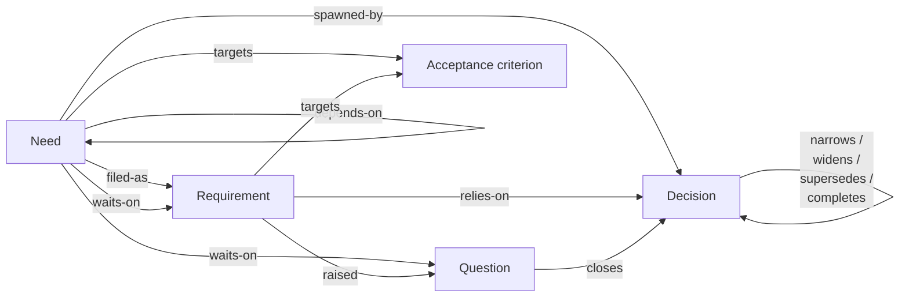

# gy — good,yes

English | [日本語](README.ja.md)

## What is gy?

gy aims to free you from the chores of "telling the AI the context it needs, and organizing that context so it gets across", so that you finish your work sooner and go home earlier.
Concretely, it takes the large amount of context that arises "after the need, before the deliverable" and holds it, together with strict invariants, as a graph of the following nodes and edges.



Using it is simple:

1. Make the AI aware of gy
   (a skill named `gy-loop` is bundled, so telling it "from today, let's work along gy-loop" is enough)
2. Tell it what you want to do and why it is needed

That is all. From then on, even in a new session, ask the AI "what's next?" and it tells you what to do next.
Details come later, but the moment gy helps most is when you overturn one of your own past decisions.

## How to use

### Install

```sh
cargo install gy

# optional (the quick way to tell the AI about `gy`)
npx skills add aq2bq/gy
```

### Telling the AI about gy

Put a sentence like the following in a prompt or in AGENTS.md / CLAUDE.md so it gets across, and the AI agent resumes from `gy handover` and `gy next` every time.

```
This project tracks its progress in gy. Before you start or resume anything, read the gy-loop skill and follow the record.
```

### Where the record itself lives

The record itself is saved by default under `$XDG_DATA_HOME/gy/<hash of the repository root>/`. Unless you set up team sharing (described below), gy never goes out to the network. Putting it inside the project's repository is not recommended, because the cycle of changes "after the need, before the deliverable" and the cycle of changes to the deliverable are completely different.

### [EXPERIMENTAL] Using gy as a team / putting the record on a remote

Still experimental, but

```shell
gy share https://github.com/you/yourproject-gy.git
```

sets a remote repository, and from then on `gy sync` is called in the background to keep it in sync. To share gy with other members, share the repository and have them run `gy join`. That is all.

#### About EXPERIMENTAL

- I built this feature over a holiday week, so the author has not used it with a team
- More than whether the sync mechanism works, I expect it will not go well without some discipline that gy cannot cover

## Mental model: "leave the project's context to gy, and face the decisions yourself"

- The explanation at every resume goes away. After resetting a session you no longer write "we are at this issue, the process is in this file, last time we finished this PR, next is X". The agent starts from `gy handover` and `gy next`.
- On "how much, and what, to tell the AI" when conveying a need: telling it in detail leads to the questions and the acceptance criteria being on the table early, and telling it "a rough fantasy for now" leads to a way of working where the necessary decisions are postponed. In the end, the number of decisions needed does not change.
- When you overturn a past decision, the new decision cannot be written without quoting which part of the old decision loses effect. The mark goes on the quoted passage only, and the rest stays in force. gy does not find the contradiction for you. Because the work being picked up is connected to that decision node by edges, the AI can understand which decisions are in force.

What remains for the human is deciding, and only deciding. Goals and needs, and answers to the questions and options the AI presents. The first line of `gy-loop` says the same: "A person cannot escape the critical decisions. gy frees them from everything else."

## The view for humans: gy serve

To look at the record yourself, use `gy serve`. The screenshots show a demo ledger built by `scripts/demo-ledger.sh`. Before you have a record of your own, run it and `gy serve` to see the same.

### Now


### Graph


### Node detail


## The five nodes and twelve edges

There are five kinds of node. Four of them form a ring that follows one turn of the work: a decision spawns needs, a need is filed as a requirement, the work raises questions, and a question closes as the next decision. The fifth kind, the acceptance criterion, measures the work from outside the ring.

| Node | ID | Meaning |
| --- | --- | --- |
| need | `n-…` | Work that must be done, aimed at acceptance criteria |
| question | `q-…` | Something undecided, with a decider and at least two options |
| decision | `d-…` | A decision with the conditions under which it applies |
| requirement | `r-…` | A need turned into an approval request, with an outward reference |
| criterion | `ac-…` | An acceptance criterion that work is counted against |

Edges are stored on the node they start from; the reverse direction is derived, never written twice. An edge is one of twelve relations, and each relation is only allowed between the kinds shown here.

| From → to | Relation | Reverse |
| --- | --- | --- |
| question → decision | `closes` | `closed-by` |
| decision → decision | `narrows`, `widens`, `supersedes`, `completes` | `narrowed-by`, `widened-by`, `superseded-by`, `completed-by` |
| need, requirement → criterion | `targets` | `targeted-by` |
| need → decision | `spawned-by` | `spawns` |
| need → requirement | `filed-as` | `files` |
| need → need | `depends-on` | `depended-on-by` |
| requirement → decision | `relies-on` | `relied-on-by` |
| requirement → question | `raised` | `raised-by` |
| need → question, requirement | `waits-on` | `awaited-by` |

A decision is stored with its scope note (where it holds), so a later reader can tell where it does and does not hold. `narrows` and `supersedes` also name the passage of the older decision that loses effect; the mark is checked against that decision's text when the edge is written.

## How a requirement moves

A requirement has four states: `filed` (registered), `approved` (design confirmed), `done` (shipped), and `cancelled`. Approval, revision, completion, and cancellation are each one command that records who heard the design, the evidence, and the reason, and every other transition is refused.

| From | To | Command |
| --- | --- | --- |
| filed | approved | `req approve` |
| approved | filed | `req revise` |
| approved | done | `req done` |
| filed, approved | cancelled | `req cancel` |

Approval is the gate for outside work. gy cannot see what is built outside the ledger, but it refuses to record its result: `criterion satisfy` is refused unless an approved or done requirement `targets` the criterion, and the refusal says the command that comes next (`req add …` or `req approve …`). While a requirement is approved, its title, body, `targets` and `relies-on`, and the title and body of the criteria it targets, cannot be edited; `req revise` sends it back to filed first. Who approves is your policy, not gy's: the bundled `gy-loop` skill has the agent ask once whether you read every requirement, only the first, or leave it to the agent.

gy holds nothing about the work after approval except these four records. Where the implementation is tracked, how it is designed, and when it is audited belong outside gy, in the issue and pull request that the requirement's reference points at.

## Where the ledger lives

The canonical ledger is an append-only event log. The repository itself holds only `gy.toml`. Every write is one transaction appended to the log with the sequence number, time, actor, reason, and source; nothing is edited in place.

`undo --reason <text>` inverts the last transaction as a new one, so the history keeps both the mistake and the correction. It undoes one transaction only; a second undo undoes the first undo (a redo). The log is the ledger; a snapshot file alongside it only speeds up opening and can be deleted.

## The twenty-six operations

A write adds a transaction of your own to the ledger: it names who wrote and why, and `undo` applies to it. A read leaves the ledger as it is. Three operations are neither; they decide where the ledger lives.

Before the first write (1):

| Operation | Result |
| --- | --- |
| `init <scope>` | Start a repository here: write `gy.toml` with one scope, then name the skill to read and the first node to file. A `gy.toml` already here is reported, not touched |

Reads (6):

| Operation | Result |
| --- | --- |
| `show <ID\|ref>... [--full]` | One or more nodes by ID, alias, or reference, with what each still lacks |
| `list [--type] [--status] [--targets] [--grep] [--actor] [--since]` | Node rows, or write units when `--actor` or `--since` is given. The type and status words ignore case, and `--since` takes a sequence or a date (`YYYY-MM-DD`, from that day's start in your own place) |
| `next` | The needs whose prerequisites are settled |
| `handover` | In-progress requirements and the counts a session needs to resume |
| `publish [--scope] [--since] [--out]` | Write the record at a point and range into a directory: one file per node and a scope index |
| `serve` | Read the ledger in a browser, on 127.0.0.1 (GET only, no write path), until stopped. It opens the browser when started from a terminal |

Where the ledger lives (3, experimental):

These exist only for sharing with a team. With no `remote` in `gy.toml`, none of them is ever used and gy stays local. They change things outside the ledger's own history: `share` writes `gy.toml` and uploads the ledger, and `sync` pushes commits.

| Operation | Result |
| --- | --- |
| `share <URL>` | Start sharing (experimental): check the remote, write `remote` into `gy.toml`, upload the ledger, print the protection and the invitation |
| `join` | Join (experimental): check what you need with the fixes, fetch the copy, say who you write as and what is next; harmless to repeat |
| `sync` | Sync with the remote (experimental): fetch a missing copy, push unpushed writes one commit each, take in a remote that moved ahead and re-seat your writes; on failure, say why and what to do |

Writes (16):

| Operation | Result |
| --- | --- |
| `need add "<title>" --targets <AC>... [--spawned-by <D>] [--body-file <path>]` | File a need against acceptance criteria |
| `need close <ID> --by fact\|external --evidence <text>` | Close a need without a requirement |
| `question add "<title>" --decider <name> --options <text>... [--body-file <path>]` | Open a question with a decider and at least two options |
| `question close <ID> --by fact\|decision\|non-decision --evidence <text> [--decision <D>]` | Close a question and, when decided, record the decision |
| `criterion add "<title>" [--body-file <path>]` | Add an acceptance criterion |
| `criterion satisfy <AC> --evidence <text> [--revoke]` | Record that a criterion holds, or revoke it |
| `req add "<title>" --need <N>... [--relies-on <D>]... [--targets <AC>]... [--ref <ref>] [--body-file <path>]` | File a requirement against needs, decisions, and criteria |
| `req approve <ID\|ref> --design <text> --heard-by <name> --evidence <text>` | Confirm the design of a requirement |
| `req revise <ID> --reason <text> --source <text>` | Send an approved requirement back to filed |
| `req done <ID> --evidence <text>` | Record that an approved requirement shipped |
| `req cancel <ID> --reason <text> --source <text>` | Cancel a requirement that was not done |
| `decide "<title>" --scope-note <text> [--body-file <path>] [--closes <Q>]... [--relate <relation> <D> --mark <text>] [--source <text>]` | Create a decision, close questions, and record one lineage edge |
| `link <from> <relation> <to> [--mark <text>] [--remove]` | Add or remove one edge |
| `edit <ID> --reason <text> [--title] [--body-file] [--set k=v] [--append k=v]` | Change a node's title, body, or free attributes. A free attribute is a string; `--set` overwrites it, `--set k=` drops it, and `--append` adds one line, separated by a newline. `--set scope=<name>` moves the node to a scope gy.toml declares, and `--set decision_scope=<text>` records a decision's unrecorded applicability conditions once |
| `scope rename <old> <new>` | Move every node of a scope to a new name and rewrite gy.toml, keeping its comments and order |
| `undo --reason <text>` | Invert the last transaction |

Every write prints what it changed, what the node still lacks, and the shape of the command that could come next, so the next step is visible without a separate instruction sheet. A write that creates a node (`need add`, `question add`, `criterion add`, `decide`, `req add`) prints `id: <ID>` as its first line. Pass `--json` for the same content as data.

## Dates and times

A node's `created`, a criterion's `satisfied_at` and a requirement's recorded dates are stored as UTC instants; `show` and `list` print them in your own time zone (`TZ`) as `YYYY-MM-DD HH:MM`, while `--json` and `publish` keep the stored value (`2026-09-18T07:28:56Z`). To name a point in time to another agent, use the write sequence or a node id, not a date.

## Resuming a session

A new session starts with three commands. `handover` shows the in-progress requirements with their references, the number of open questions, the number of ready needs, and the errors and warning counts. `next` lists the needs whose prerequisites are settled, and the agent presents one of them to the person it works for. `show` reads one node in full. There is no `lint` pass to run later: an invalid write is refused when it is made, and what needs attention is counted by `handover`.

```sh
gy handover
gy next
gy show n-3f9a
```

## gy.toml

The only configuration is a scope name and, if wanted, an output path for `publish`. Anything else is refused when the file is read.

```toml
# Optional. publish writes here when --out is not given.
output = "docs/publication"
# Optional (experimental): the ledger-only git repository. See "Working as a team".
remote = "https://github.com/you/yourproject-ledger.git"

[scopes.myproject]
```

Reads cover every scope. A write needs a scope only when the file names more than one; pass `--scope <name>` to choose. The first write creates the ledger, and reads never do.

## Working as a team (experimental)

A team shares one ledger through a ledger-only git repository. The members are people, each on their own machine and with their own copy of the ledger: the person starts it with `gy share` and another joins with `gy join`, and each person's agent writes to that person's copy. Two agents on one machine already share the local ledger and need no remote. There are two procedures, and in both gy says what to do next.

**Start sharing (the one who used gy alone).** Create an empty private repository on GitHub and run, in a checkout of the project:

```sh
gy share https://github.com/you/yourproject-ledger.git
```

It checks the remote (empty or ledger-only, and that you can push), writes `remote` into `gy.toml`, uploads the ledger you have as it is, and prints how to protect the branch (require linear history, block force pushes; gy changes no settings) and the invitation to send a member. Commit `gy.toml` with the project.

This step is yours, not your agent's. `gy share` uploads the whole ledger to that repository; an agent's runtime may treat the upload as sending data out and refuse it, and an agent cannot grant itself the permission. Run `gy share` yourself, once, as you create the repository and protect its branch yourself, or allow `gy share` and `gy sync` in the agent's settings yourself. After that the agent writes as before and the pushes happen in the background.

**Join (the one invited).** Get write access to the ledger repository, clone the project, and run:

```sh
gy join
```

It checks what you need in one go (git, credentials that can read the repository, and a name to write under — `git config user.name` and `user.email`, or `GIT_AUTHOR_NAME` and `GIT_AUTHOR_EMAIL`) and, if something is missing, lists each with the fix and stops. When all is there it fetches your copy, says who you will write as (`user.name / GY_ACTOR`) and what to do next (`gy handover`). Running it again is harmless. Starting with `gy handover` instead also fetches the copy and prints the same "joined" line.

**From then on, use gy as before.**

- A write lands in your copy at once and is pushed in the background (right after the write, and every ten seconds while `gy serve` runs). `gy sync` syncs explicitly. While the remote is unreachable, reads and writes keep working, and what piled up is pushed when it is back.
- If the remote moved ahead, your unpushed writes are re-seated after it. Only a write to a node the other side changed first is rejected, and only you are told: on stderr at your next gy command and in `handover`. Whether to redo it is your call.
- A writer is recorded and shown as `user.name / GY_ACTOR`; the same agent name under two humans is two writers. The name is the one git signs your commits with, resolved git's way — `GIT_AUTHOR_NAME` first, then `git config user.name` — so the ledger and the git history never name two people for one write.
- The remote is written by gy alone: one write is one commit, and a history changed outside gy is refused with the way back. A repository holding anything but a ledger is refused.
- Remove the `remote` line from `gy.toml` and the copy is local again (the next command says so once). Reconnecting after both sides moved is refused: there is no merge.

A ledger holds the exchanges behind decisions. Putting it on a remote means that record is on GitHub.

## Who writes

Every write names its actor in `GY_ACTOR`. An unset or blank value is an error, and the name is kept in the history beside the reason and source.

```sh
export GY_ACTOR=leader
```

Each agent writes its own records with its own name, so the history shows who changed what and why.

## IDs, aliases, and refs

gy allocates each ID itself, as a kind prefix and a short hash, such as `n-3f9a`. A hash always contains at least one letter a–f, so it never looks like an old ID. No counter is shared, so two agents writing at once cannot collide; a collision just mints a longer hash. `show` accepts the exact ID, an alias (zero-padding and case are ignored, so `D-8` = `D-08`), or a requirement's outward reference by exact or suffix match.

An existing ledger keeps its old IDs as aliases, so `show D-164` and `show '#6027'` both reach the renamed node. A requirement's reference (`--ref`) is opaque: gy stores it and never reads what it points at.

## publish

`publish` writes the record at a point and range into a directory to commit: one file per node under `<out>/<scope>/<kind>/`, and a scope index at `<out>/<scope>/README.md`. It is a development artifact: later, an agent reads it to review what was decided and why, and diffs one publication against the next. It is not reading matter for the person the agents work for, and gy adds no human-facing output format.

A node file holds the id with its old aliases and reference, the title, scope, creation date, state, scope note (where it holds), the body, both edge directions with the other side's id, alias, title, and mark, the closure and evidence, the requirement records, and the free attributes. Every reference carries the target's title, so each file stands on its own. A decision file puts its lineage relations first.

The index holds the generated time, the log sequence, the scope and range, the writer, and the canonical location; a short "how to read" section; a per-kind list with a link and state for each node; the write history; and the diagnostics.

`--out` names the output directory, `gy.toml`'s `output` names a default, and without either publish is an error. Only the target scopes' directories are removed and rewritten; other files under `--out` and other scope directories are left alone.

## Development

```sh
cargo fmt --all -- --check
cargo clippy --workspace --all-targets --locked -- -D warnings
cargo test --workspace --locked
```

The workspace holds `gy-ledger` (the store, model, and operations), `gy-serve` (the read-only web view), and `gy` (the CLI). CI tests on Linux; other platforms are unverified. The screens of `gy serve` have their own end-to-end tests under `e2e/` (Playwright, chromium): see [e2e/README.md](e2e/README.md); they are not part of `cargo test`.
