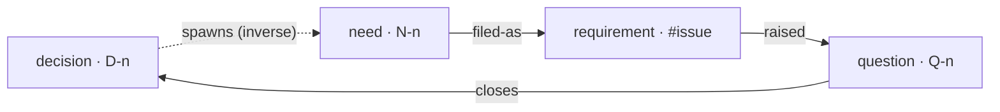
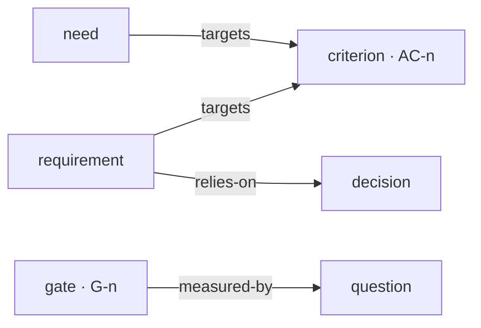
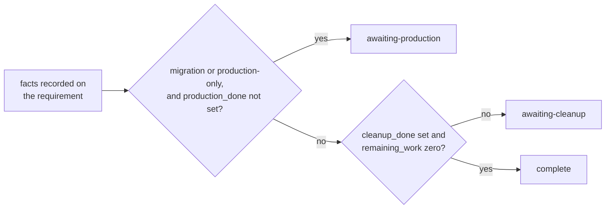

# gy — good,yes

English | [日本語](https://github.com/aq2bq/gy/blob/main/README.ja.md)

A Rust CLI that keeps decisions, questions, needs, requirements, acceptance criteria, and continuation gates as a graph of Markdown files. Agents write through the CLI or MCP; people read the ledger that `render` generates and the records that `show` prints.

`lint` checks only the internal consistency of that graph. Whether the ledger matches the code, GitHub, and production is for the user to verify. gy never calls the GitHub API.

## What happens at the end of a project

Work delegated to an agent does not need to be read while it goes well. Because it does not need to be read, it stops being read. How far the work gets depends on how much fits in the context, how large the target is, and how strong the model is, and none of that dependency is visible while things go well.

It becomes visible at the end. When a requirement has to be declared complete. When a decision that earlier work relied on has quietly been replaced. When leftover work has to go somewhere. And when the one person accountable is holding several projects at once and cannot read all of them. None of the four happens while things go well. When one does, nobody remembers what the work was based on.

gy exists for that end. It holds no plan. It records what each piece of work was based on and what must hold before the work can be called finished, and it reports where those records contradict each other. A decision cannot be recorded without the conditions under which it applies. A question cannot be opened without naming whose agreement closes it. A requirement cannot reach `complete` without stating its deviations and where its remaining work went.

## Whether ADRs and an issue tracker are enough

Anyone who has read this far and thinks this is a job for tools that already exist is half right.

- **Publishing decisions for a team to read.** That is what ADR tools do. gy requires fields on every record and keeps the graph consistent, and both get in the way of a reader who only wants the history.
- **Choosing what to work on next.** "What is unblocked, and who took it" is an issue tracker's question. `next` only lists the needs whose prerequisites are resolved; it neither assigns nor schedules.
- **Checking reality.** gy does not call the GitHub API, fetch URLs, run tests, or authenticate approvers. Every external fact in the ledger was reported by a person or an agent. gy checks only whether those reports agree with each other.

The other half is the situation none of the three covers. Several projects run in parallel, the work is delegated to agents, and one person is accountable for all of it without reading all of it. That is when gy pays for itself.

## The shape of the ledger

There are six node types. Four of them form a ring, and the ring is why gy exists. A decision spawns new needs, a need is filed as a requirement, the work raises new questions, and a question closes as the next decision. Records do not break inside a node. They break between nodes.



The node names are the values of the `type` attribute, and the edge labels are the words passed to `link`. Only the dotted edge is drawn with its inverse name so the ring reads in one direction; the label `link` accepts is `spawned-by`, from the need to the decision.

The remaining two types stay out of the flow. They measure it from outside. Acceptance criteria are what progress is counted against, and gates decide whether the approach itself should continue.



Two relationships stay within one type and are left out of the diagrams. Decision to decision is lineage (`narrows` / `widens` / `supersedes` / `completes`), and need to need is ordering (`depends-on`). The direction and inverse attribute of all twelve labels are listed under [Attributes and relationships](#attributes-and-relationships).

## The first ledger

Install from crates.io, create one scope, and place one criterion, one need, one question, and one decision.

```sh
cargo install gy --locked
gy init demo --parent-issue 6000
gy criterion add "Retries must not cause duplicate deliveries" --scope demo
gy need add "Make retries safe" --targets AC-1 --scope demo
gy question add "How should deliveries be ordered?" \
  --decider master --options "Publication time" --options "Arrival time" --scope demo
gy decide "Order deliveries by publication time" \
  --closes Q-1 --scope-note "Applies to production workers; excludes batch replays" --scope demo
gy lint
gy render
```

`gy lint` reports nothing here. The decision has its applicability conditions, the question has a decider and two options, and the need targets a criterion. Drop `--scope-note` from the `decide` line and the CLI refuses before anything is written, because a decision without conditions gets applied too widely later.

`init` creates `.gy-dir`, `docs/ledger/gy.toml`, and the scope directories, and appends a pointer to the ledger to an existing `AGENTS.md`. Later commands find the ledger from any subdirectory. Reads cover every scope; only writes need one. To create a node, run inside the scope directory or pass `--scope`; a command that updates an existing ID writes to that ID's scope. To rename a scope, use `gy scope rename <old> <new>`. It renames the directory, the member nodes, and the configuration together, and node IDs, relationships, records, and history stay as they were.

To install from a source checkout, run `cargo install --path crates/gy --locked`.

## Commands

| Command | Result |
| --- | --- |
| `init <scope>` | Create a ledger and scope |
| `scope rename <old> <new>` | Rename a scope, keeping node IDs, relationships, records, and history |
| `need add` / `need file` | Create a need that targets acceptance criteria; associate it with a requirement |
| `question add` / `question close` | Register a question after searching across scopes; close it in one of three ways |
| `q "one sentence"` | A quick note for people; lint fails until the required information is supplied |
| `decide` | Record a decision with its applicability conditions and close the named questions |
| `link <source> <label> <target>` | Record a relationship in both nodes' frontmatter |
| `req add` / `req advance` | Register requirements and record state transitions with evidence |
| `req compress <issue>` | Check that constraints became decisions, then compress an archived record to six items |
| `criterion add` / `criterion satisfy` | Create acceptance criteria and record the evidence of satisfaction |
| `gate add` | Create a gate for deciding whether an approach continues |
| `node set` / `node submit` | Edit attributes or body text; validate and submit a configured record |
| `find` / `show` | Search attributes and text; display a node with relationships on both sides |
| `next` | List needs whose prerequisites are resolved |
| `lint` / `handover` | Check consistency and the records a handover needs |
| `stats` | Report satisfied criteria and question arrival rates from git history |
| `render` | Generate paginated Markdown, DOT, or a single HTML file |
| `import <directory>` | Import ADRs, keeping their IDs |
| `cheatsheet` / `completions <shell>` | Print a workflow reference or shell completions |
| `skills install <dir>` / `mcp serve` | Install the agent skills or start the MCP server |

Every command accepts `--json`, `--quiet`, `--verbose`, `-C <dir>`, and `--scope`. With `--json`, results go to standard output and diagnostics to standard error, both as JSON. `--quiet` suppresses ordinary output and keeps JSON results and errors.

A mutating command returns only a summary of the nodes it changed: `id`, `type`, `scope`, `changed_attributes`, and `body_changed`, without attribute values, body text, or evidence. `changed_attributes` lists real changes: every name on creation, removed names on update, and `[]` with `false` when nothing changed. Read the full node with `gy show <ID> --json` and search with `gy find`. CLI JSON and the MCP structured result share the same shape.

Exit codes are 0 for success, 1 for a failed check, 2 for missing or invalid input, a nonexistent reference, or a guard violation, and 3 for a ledger that cannot be parsed or is corrupt. `handover` also returns 1 when next-transition evidence, a responsible party, or a referenced node is missing.

## Attributes and relationships

The five required frontmatter attributes are `id`, `type`, `title`, `scope`, and `created`. Attributes gy does not know survive reads and writes. Set values with `node set --set key=value`; a value that parses as JSON is stored as an array, number, boolean, or object.

```sh
gy node set N-1 --set 'waiting-on=["Q-2"]' --set 'custom={"region":"east"}'
gy find --where custom.region=east
gy find delivery --where type=decision --where 'created>=2026-09-01'
gy node set D-1 --body-file decision-body.md
```

Search operators are `=`, `!=`, `>=`, `<=`, `>`, `<`, and `~` (substring). Numbers compare as numbers; everything else compares as strings, which puts ISO dates in chronological order. Results show the matching section: Context, Decision, or the applicability conditions.

| Attribute | Meaning |
| --- | --- |
| `decision_scope` | Conditions under which a decision applies; passed as `--scope-note` at creation |
| `decider` / `options` | Who decides a question, and an array of distinct options |
| `bundle` / `bundle-rationale` | A bundle of questions and why one intervention closes them all |
| `waiting-on` / `unresolved` | Arrays of IDs referenced as unresolved |
| `raised-by` | The requirements that raised a question; several are allowed |
| `belongs-to` | A question's owning node IDs; L4 reports two or more distinct owners |
| `bearer_count` | The stated number of needs supporting a criterion; compared with actual `targets` links |
| `parent_issue` | A confirmed parent Issue number; compared with the configured value |
| `status` | One of the 11 requirement states, or `open` / `closed` for a question |
| `pr_url` / `pr_base` / `pr_files` | The PR URL, base branch, and changed-file count recorded on a requirement |
| `remaining_work` | A legacy remaining-work count or array; checked against `residual` when present |
| `summary` / `contracts_changed` | One sentence on what was achieved, and the changed contracts as free text or a list |
| `artifacts` | `pr`, `merge_commit`, `base_branch`: where the deliverables are |
| `production` | Production measurements and verification results, or `none` when there was no production work |
| `deviations` / `residual` | Deviations and extra decisions; where transferred work went. Each is `none` when absent |
| `compressed` / `compressed_from` | Compression date and the archive comment URL; not counted among the six items |
| `next_evidence` / `responsible` | Evidence for the next transition and the responsible party of an active requirement |
| `constraints` | Constraints later work inherits; each entry has `text` and `decision` |
| `constraints_reviewed` | A record that each constraint was reviewed |
| `satisfied` / `satisfied_at` | Whether a criterion is satisfied, and when that was recorded |

Relationships have the following directions and inverse attributes. `link` writes both sides; `lint` checks symmetry and node types.

| Direction | Label | Inverse attribute |
| --- | --- | --- |
| question → decision | `closes` | `closes` |
| decision → decision | `narrows` / `widens` / `supersedes` / `completes` | `narrowed-by` / `widened-by` / `superseded-by` / `completed-by` |
| need / requirement → criterion | `targets` | `targeted-by` |
| need → decision | `spawned-by` | `spawns` |
| need → requirement | `filed-as` | `filed-from` |
| need → need | `depends-on` | `needed-by` |
| requirement → decision | `relies-on` | `relied-on-by` |
| requirement → question | `raised` | `raised-by` |
| gate → question | `measured-by` | `measures` |

For `narrows` and `supersedes`, `--mark` names the passage of the older decision that loses effect. The stored body is untouched; `show` and `render` add the mark at display time. If the passage cannot be found in the body, it is listed separately, so a mark never moves silently to some other passage.

## How a requirement reaches complete

A requirement has 11 states. Laid out in a table they look like a staircase, but gy checks no order between them. Each state has guards of its own, and as long as those guards pass, a requirement can move from any of the 11 states to any other, forwards or backwards. What every transition needs instead is `--evidence`, and each one is appended to the `transitions` history with its origin, destination, and time.

```text
unfiled / defining / awaiting-design / awaiting-approval / awaiting-implementation /
awaiting-audit / awaiting-pr / awaiting-merge / awaiting-production / awaiting-cleanup / complete
```

`defining` means the requirement is still being defined. A state can carry a note in parentheses, such as `awaiting-implementation (phase 2)`. A ledger written with the earlier Japanese state values needs those values, and the explicit absence value, changed to English before use; gy does not migrate them.

```sh
gy req add "Retry control" --issue 6006 --parent-issue 6000 --scope demo
gy need file N-1 --issue 6006
gy node set '#6006' --set pr_url=https://github.com/org/repo/pull/6007 \
  --set pr_base=main --set pr_files=3
gy req advance 6006 --to awaiting-merge --evidence "Record of PR diff review" \
  --reported-base main --reported-files 3
```

`--reported-base` and `--reported-files` are values the user has checked. gy compares them with the frontmatter and asks nothing about whether the PR exists or what its diff contains.

There is no order between states, with one exception: the last three. Nobody chooses among them. A move to `awaiting-production`, `awaiting-cleanup`, or `complete` must report `--data-migration true|false` and `--production-only true|false`, and gy computes which of the three the recorded facts allow. Naming a different one is rejected.



Completion needs `--cleanup-done true` and no remaining work without a destination. A completed requirement records `deviations` and `residual` explicitly. `residual` is `none` or existing destinations of the form `N-xx`, `Q-xx`, or `#Issue`. If `remaining_work` is still present, it must be zero or an empty array.

```sh
gy node set '#6006' --set remaining_work=0 --set deviations=none --set residual=none
gy req advance 6006 --to complete --evidence "Reviewed the remaining-work list" \
  --data-migration false --production-only false --cleanup-done true
```

## Compressing a completed requirement

Left alone, a completed requirement stays in the ledger with its transition history, its PR details, and its constraint list. What later readers want is six things: what was achieved, which contracts changed, where the artifacts are, what was verified in production, where the design was deviated from, and what was left over. `req compress` keeps those six and moves everything else to an Issue comment.

It would be reasonable to expect gy to do the moving. It does not. gy never writes to GitHub, so the step is a round trip: gy prints the full record, the user posts it as a comment on the Issue, and the user hands the comment URL back to gy. During that round trip, the only one who knows whether the whole record was archived is the user.

First, map each entry in `constraints` to a decision that has applicability conditions, and add a `relies-on` link. `constraints_reviewed=true` records that the user did the review; gy cannot tell whether a constraint was left out of the record. Then write the six items into the frontmatter. `summary` is one sentence on one line about the outcome, separate from the title. `contracts_changed` is free-form; gy does not normalize it against a project's quality-gate table.

```sh
gy node set '#6006' \
  --set 'summary=Prevented duplicate order lines with a unique constraint.' \
  --set 'contracts_changed=["orders.order_lines (added UNIQUE constraint)","POST /api/v1/orders (added 409 response)"]' \
  --set 'artifacts={"pr":"https://github.com/org/repo/pull/6007","merge_commit":"a1b2c3d","base_branch":"main"}' \
  --set 'production={"migration_total":12431,"migration_updated":87,"migration_remaining":0,"verified_env":"production","verified_at":"2026-09-09"}' \
  --set deviations=none --set residual=none
gy node set '#6006' \
  --set 'constraints=[{"text":"Prevent duplicate order lines","decision":"D-1"}]' \
  --set constraints_reviewed=true
gy link '#6006' relies-on D-1
gy req compress 6006 > archive.md
```

Post the full contents of `archive.md` as a comment on the Issue and pass its URL. If the requirement is edited after archiving, archive the latest contents again.

```sh
gy req compress 6006 \
  --evidence 'https://github.com/org/repo/issues/6006#issuecomment-123'
gy find --where 'contracts_changed~orders.order_lines'
```

Without `--evidence`, the command changes nothing: it checks the record and prints the original file in full. With `--evidence`, it still prints the original to standard output, then replaces the body with the six items. Under `--json`, `archive` holds the full text and `node` the compressed record. An update that carries the archive URL rechecks the constraints and all six items.

After compression the record keeps its ID, the required attributes including `created`, both sides of every edge, and any attribute gy does not know. The six items stay as searchable attributes, and `show` / `render` build the body from them. Relationships such as acceptance criteria are not repeated in the body. A `targets` link placed directly on a requirement keeps its inverse too, though L2 counts only needs as bearers of a criterion.

Compression removes these known attributes: `constraints`, `constraints_reviewed`, `remaining_work`, `transitions`, `record_history`, `next_evidence`, `responsible`, `pr_url`, `pr_base`, `pr_files`, `data_migration`, `production_only`, `production_done`, `cleanup_done`, `evidence`, `quality_gates`, `design_proposal`, and `audit_records`. They survive in the archive along with the original body. Other extension attributes are kept. A compressed record cannot be compressed again to overwrite its original archive pointer.

Transferred work is written as `residual=[{"id":"N-2","note":"Transferred performance improvements"},"Q-3","#6010"]`. Each destination must be an existing node. Blank values, null, and empty arrays are not the same as `none`, and L11 reports them.

## Configuring lint and render

```toml
# docs/ledger/gy.toml
parent_issue = 6000

[scopes.demo]
parent_issue = 6000

[lint]
L1 = "error"
L6 = "warn"
L2 = { enabled = true, severity = "error" }
# Use false or "off" to disable an individual rule.

[render]
output = "{scope}/README.md"
split_threshold = 100
# HTML output, at the ledger root (default) or per {scope}
html_output = "gy.html"
```

| Rule | Check |
| --- | --- |
| L1 | Closed questions still referenced as unresolved |
| L2 | Stated bearer counts differ from the needs that actually support a criterion |
| L3 | Needs without acceptance criteria |
| L4 | Questions with more than one owner |
| L5 | Unfinished requirements relying on superseded decisions |
| L6 | Missing marks for narrowed or superseded passages |
| L7 | Decisions without applicability conditions |
| L8 | Questions without a decider |
| L9 | Questions with fewer than two distinct options |
| L10 | Requirement states outside the allowed set |
| L11 | Missing or inconsistent completion and compression records |
| L12 | Question bundles without a rationale |
| L13 | References to nonexistent nodes |

L6 defaults to `warn`; the others default to `error`. Outside the table, the `edges` rule checks inverse links, edge types, and matching marks. A question created with `q` and left incomplete reports what is missing as an error regardless of the L8 / L9 settings.

Every rule works from explicit frontmatter. L1 reads `waiting-on` and `unresolved`; L2 reads the optional nonnegative integer `bearer_count` and the `targets` links. Neither infers a declaration from body text. A declaration that exists only in prose should be verified and moved into an attribute.

`relies-on` stays on a requirement after it completes, because it is the history of what the requirement was based on. L5 looks at the current dependencies of unfinished requirements; a superseded dependency of a completed one appears in `show` and in `handover.historical_superseded_dependencies` as history. Reopening the requirement puts it back under the current check. Broken links, missing inverses, and incomplete completion records stay errors after completion. Being filed as history is not a statement that reality was checked. The authority, lifecycle, and rule contracts are defined in [ledger semantics](https://github.com/aq2bq/gy/blob/main/docs/architecture.md).

`render` splits each scope into pages of the configured node count and adds a README index when there is more than one page. Output paths are relative to the ledger directory and cannot point into the directories that hold the source nodes.

`stats --days 7` reports new question counts, daily rates, and the change between the most recent seven days and the seven before. It counts the first addition of each ID across all git refs; a body edit is not a new arrival, and an uncommitted question is not counted. When the earlier period had no arrivals, the decay fraction is null.

## Reading the ledger as HTML

`render --format html` writes one self-contained HTML file. It embeds the whole ledger and the judgments returned by `lint`, `next`, `handover`, and `stats`, and it never goes to the network, so it works opened from `file://`.

The first screen shows acceptance, the state distribution, open questions, and lint counts, and each count links to the matching records or to the Blockers findings. Below it is the table, which is the main reading surface. Titles wrap in full, and a click anywhere on a row opens the details. The display state, including the sort order, lives in the URL hash, so a record can be reached directly by ID and the browser's back button returns to the previous view.

The graph sits under the table and switches between two views by the number of visible records. With many records it draws clusters by scope and type, joined by aggregated edges with their counts; clicking a cluster filters the table to that scope and type. With few records it draws individual nodes laid out to reflect their connections, and the neighborhood hop count is chosen per starting node so the result fits the individual-view limit. Decisions read as a lineage layered by generation along `narrows` / `widens` / `supersedes` / `completes`, with superseded decisions marked. Body text is never drawn on the graph; it is read in the detail panel.

Clicking a node or a table row moves neither the focus, the filters, nor the layout. It only opens the details. Focus moves through the neighborhood button; **↶** goes back one step and clicking the path goes back several. **All** drops the focus while keeping filters and lineage, and **Reset all** clears those too and restores the default table order. The detail panel shows type, scope, state, satisfaction, closure, and supersession as badges, with the applicability conditions and the body in separate reading sections. A mark that matches the body is annotated at that passage; one that does not is listed separately and never moved to another sentence. Extra attributes keep their full values, including `false`, `0`, and `null`. HTTP(S) links open only when followed.

`html_output` defaults to `gy.html` at the ledger root and produces one file per scope only when it contains `{scope}`. `split_threshold` does not apply to HTML, and lint results never change the exit code. Regenerate an existing file with `gy render --format html` to pick up new behavior; the ledger needs no migration, and rendering again only replaces the derived HTML without touching the records. The rules for layout, fit, and label sizing are in [the HTML projection section of docs/architecture.md](https://github.com/aq2bq/gy/blob/main/docs/architecture.md#html-projection).

`init` appends the default HTML output (`html_output`, by default `gy.html`) to the `.gitignore` at the ledger root. An existing `.gitignore` is appended to, never rewritten, and running `init` again does not duplicate the line. For a ledger created before this behavior existed, either run `gy init <scope>` again with the existing scope name or add the `html_output` value by hand. Running it again is append-only and idempotent, and nodes, relationships, records, and history are kept. It does, however, rewrite `gy.toml` in normalized form: the values survive, but comments and formatting do not (an inline table becomes a `[table]` section, for example). If `gy.toml` holds operating notes as comments, adding the `.gitignore` line by hand is the safer choice.

## Record schemas and transition guards

`[workflow.records]` in `gy.toml` defines record types, their required fields, and how blanks and "not applicable" are treated; `[workflow.guards]` defines which records a state requires and how records are checked against each other. A ledger without this configuration gains no new required fields.

Write a record with `gy node set` and validate and submit it with `gy node submit <ID> --record <name> --evidence <evidence>`. Submission changes no state; it stores the checked values, the schema, and the evidence in `record_history`. `gy req advance` checks the guards of the destination state and, when they pass, stores the records it checked in `transitions[].workflow`. Missing inputs appear under `workflow` in `gy lint`, and `gy handover --json` includes the effective schemas and guards. What is checked is the consistency of reported records, never whether a URL resolves, what a PR's real diff is, whether tests passed, or whether an approver is a person.

The bundled example asks for an approver, target revision, reason, and stop condition even when the design is waived. An ordinary design revision keeps its path, bumps its version, and needs approval of the new version. Its quality-gate check records failures, gates that could not run, and pre-existing violations as distinct outcomes; it does not demand that every gate pass. A policy that allows only passing gates restricts the permitted outcomes in configuration. A file whose name is not known at design time is declared through `matches-declared-files` as a fixed directory, a filename prefix and suffix, and the character class and length of the generated part, and each declaration must match exactly one reported file. A gate with no notion of a population is recorded as `passed-without-population`; `passed` still needs its denominator.

Existing users keep their own configuration and past records and add the new variants to their ledger's `gy.toml`. See the [workflow guide](https://github.com/aq2bq/gy/blob/main/docs/workflows.md), the [configuration example](https://github.com/aq2bq/gy/blob/main/crates/gy/examples/workflow.toml), the [matching illustrative records](https://github.com/aq2bq/gy/blob/main/crates/gy/examples/workflow-records.json), the [0.4 migration guide](https://github.com/aq2bq/gy/blob/main/docs/migration-0.4.md), and [quality gates with and without a population](https://github.com/aq2bq/gy/blob/main/docs/workflows.md#quality-gates-with-and-without-a-population). The current configuration applies to unfinished work and to new transitions and submissions. A completed requirement is never asked retroactively for a schema introduced later, and saved history is checked against the schema and matching rules saved with it.

## Importing existing ADRs

`gy import docs/adr --scope demo` keeps IDs, body text, and existing frontmatter. An ADR usually states where a decision applies in a section of its body, so naming that section in `gy.toml` copies it into `decision_scope`.

```toml
[import]
scope_note_section = "Applicability"
scope_note_placeholders = ["Not recorded during migration"]
```

The section is an ATX heading such as `## Applicability`, in any language, including its subsections and ending at the next heading of the same or higher level. Headings inside fenced code blocks are ignored, and a repeated matching heading rejects the import as ambiguous. An existing nonempty `decision_scope` is kept. When the section is missing, empty, or contains only a configured placeholder, the attribute stays unfilled and L7 reports it. Placeholders match exactly after trimming surrounding whitespace. Whether the text describes a meaningful condition is for people and agents to judge.

The result includes `import_summary` with the count and IDs of missing `decision_scope` values and the count and relationships of missing marks, and the same counts are printed as a warning. The import completes regardless; run `gy lint` afterward.

`narrows` and `supersedes` entries imported from frontmatter carry `imported: true`, and L6 reports their missing marks as migration work at the usual severity. Read the older decision and run `gy link <new-ID> <relationship> <old-ID> --mark "<affected passage>"`; both sides are updated and the import provenance of that relationship is replaced by the ordinary operation. Import never infers relationships or marks from prose or Markdown links.

## MCP and bundled skills

```sh
gy skills install .agents/skills
npx skills add aq2bq/gy
gy mcp serve
```

MCP exchanges one JSON-RPC message per line over standard input and output. Configure the client to run `gy` with the arguments `mcp serve -C /absolute/project/path`. The server exposes 19 tools, among them `gy_find`, `gy_show`, `gy_question`, and `gy_decide`, and each takes an `args` array holding the arguments that would follow the corresponding CLI command. For `gy_find`, that is `{"args":["delivery","--where","type=decision"]}`.

The three bundled skills are `gy-ledger`, `gy-question`, and `gy-decide`. If a skill at the destination has been edited, installation refuses to overwrite it and asks for another destination.

`gy skills install` writes the skills embedded in the installed binary, so their text always matches the installed version; it needs an explicit destination. The skills use the standard `SKILL.md` format, so `npx skills add aq2bq/gy` installs them too, fetching from the repository rather than the binary. Choose `npx skills` for agent detection, project or global scope, and symlinked updates; choose `gy skills install` for offline use and a version-locked copy.

## Development and distribution checks

HTML focus-state and fit regressions run with `node --test tests/html_navigation.test.cjs`. Node.js is needed only for these development tests, not for building gy or generating HTML. Browser interaction and hit testing run with Playwright:

```sh
cd e2e
npm ci
npx playwright install --with-deps chromium
npm test
```

This builds the local CLI and generates synthetic ledgers that are safe to publish. The separate HTML E2E job in CI runs Chromium on every run, including known-defect injection. These development dependencies live outside both Rust crates, and the generated HTML stays a single file. The measured performance scope, and how failed assertions after injection prove that defects are detected, are in [e2e/README.md](https://github.com/aq2bq/gy/blob/main/e2e/README.md).

```sh
cargo fmt --all -- --check
cargo clippy --workspace --all-targets --locked -- -D warnings
cargo test --workspace --locked
cargo package --workspace --allow-dirty
cargo install --path crates/gy --locked --root target/install-check
```

`gy-core` provides storage, operations, checks, and views; `gy` provides the clap CLI and the MCP server. Reads and writes both take a ledger-wide file lock. A multi-file update, including the directory removal of a renamed scope, is journaled before it is applied, and an interrupted one is completed at the next start. Commit `.gy-ids.json` with the ledger: it records allocated numbers so a deleted number is never reused. Do not commit `.gy.lock`.

CI tests and installs on Linux. Other platforms are not verified. The pre-commit hook entry is in [.pre-commit-hooks.yaml](https://github.com/aq2bq/gy/blob/main/.pre-commit-hooks.yaml).
