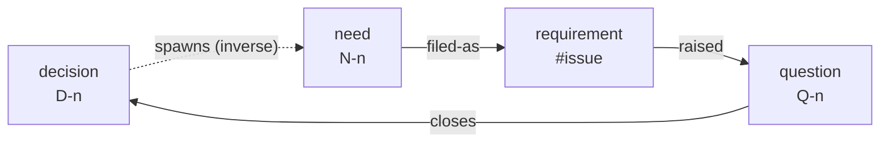
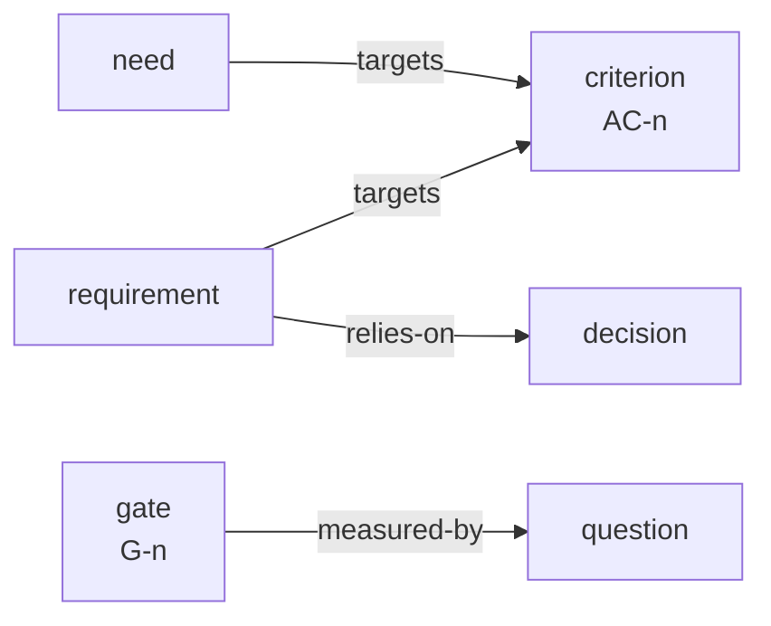
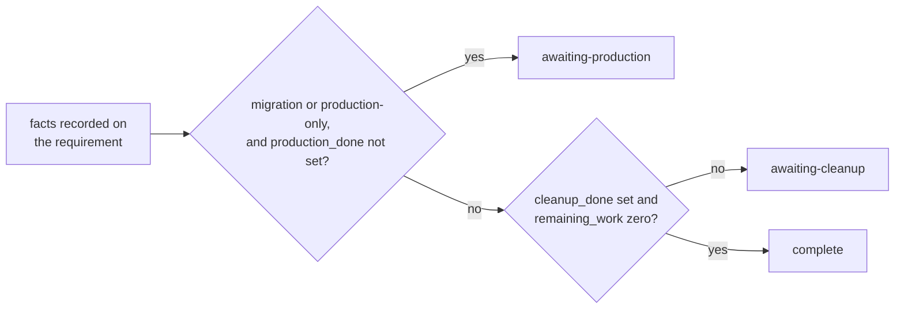

# gy — good,yes

English | [日本語](https://github.com/aq2bq/gy/blob/main/README.ja.md)

A Rust CLI that manages decisions, questions, needs, requirements, acceptance criteria, and continuation gates as a graph of Markdown files. AI agents operate through the CLI or MCP; people read the ledger generated by `render` and individual records with `show`.

`lint` checks the graph's internal consistency. Users verify whether the ledger matches the code, GitHub, and production. gy does not call the GitHub API.

The initial command set, including requirement compression, is implemented.

## Why this exists

Agents already run large projects without gy. How well they do it depends on how much context fits, how large the project is, and how strong the model is. That dependency is invisible while things go well. It surfaces at the end of a project: when a requirement has to be declared complete, when a decision that earlier work relied on has been replaced, when remaining work has to go somewhere, and when the person accountable is holding several projects at once and cannot read all of them.

gy is for that end. It does not hold a plan. It records what each piece of work was based on, and what must be true before the work can be called finished, and it reports where those records contradict each other. A decision cannot be recorded without the conditions under which it applies. A question cannot be opened without naming whose agreement closes it. A requirement cannot reach `complete` without stating its deviations and where its remaining work went.

## What gy is not for

- **Publishing decisions for a team to read.** That is what ADR tools are for. gy requires fields on every record and keeps a graph consistent; neither helps a reader who only wants the history.
- **Deciding what to work on next.** "What is unblocked, who claimed it" is an issue tracker's question. `next` only shows which needs have their prerequisites resolved; it does not schedule or assign work.
- **Checking reality.** gy does not call the GitHub API, fetch URLs, run tests, or authenticate an approver. Every external fact in the ledger was reported by a person or an agent; gy only checks that the reports are consistent with each other.

gy earns its cost when several projects run in parallel, the work is delegated to agents, and one person stays accountable for all of it without reading all of it.

## The graph

Six kinds of node. Four of them form a loop, and that loop is why gy exists: a decision creates new needs, a need is filed as a requirement, the work raises new questions, and a question closes into the next decision. Records break down between these nodes, not inside them.



The dotted edge is drawn in its inverse direction so the loop reads forward. The label `link` accepts is `spawned-by`, written from the need to the decision.

The other two kinds do not take part in the flow. They attach from the side to measure something: an acceptance criterion is what progress is counted against, and a gate decides whether an approach continues at all.



Two relationships stay within one kind and are left out of the diagrams: `decision → decision` carries the lineage (`narrows` / `widens` / `supersedes` / `completes`), and `need → need` records order (`depends-on`). All twelve labels, their directions, and their inverse attribute names are listed under [Attributes and relationships](#attributes-and-relationships).

## Installation and first records

Install from crates.io:

```sh
cargo install gy --locked
gy init demo --parent-issue 6000
gy criterion add "Retries must not cause duplicate deliveries" --scope demo
gy need add "Make retries safe" --targets AC-1 --scope demo
gy question add "How should deliveries be ordered?" \
  --decider master --options "Publication time" --options "Arrival time" --scope demo
gy decide "Order deliveries by publication time" \
  --closes Q-1 --scope-note "Applies to production workers; excludes batch replays" --scope demo
gy lint
gy render
```

Initialization creates `.gy-dir`, `docs/ledger/gy.toml`, and the scope directories, and appends a ledger reference to an existing `AGENTS.md`. Commands can discover the ledger from subdirectories. Reads cover all scopes by default. To create a node, run inside its scope directory or supply `--scope`. Commands that update an existing ID write to that node's scope. `gy scope rename <old> <new>` relabels a scope in its directory, member nodes, and configuration while preserving node IDs, relationships, records, and history.

To install from a source checkout, run `cargo install --path crates/gy --locked`.

## Commands

| Command | Result |
| --- | --- |
| `init <scope>` | Create a ledger and scope |
| `scope rename <old> <new>` | Rename a scope, preserving node IDs, relationships, records, and history |
| `need add` / `need file` | Create a need tied to acceptance criteria and associate it with a requirement |
| `question add` / `question close` | Search across scopes before registering a question; close it in one of three ways |
| `q "one sentence"` | Capture a quick human note; lint fails until the required information is supplied |
| `decide` | Record a decision with its applicability conditions and close specified questions |
| `link <source> <label> <target>` | Record a relationship in both nodes' frontmatter |
| `req add` / `req advance` | Register requirements and record state transitions with evidence |
| `req compress <issue>` | Check that constraints have become decisions, then compress an archived record into six items |
| `criterion add` / `criterion satisfy` | Create acceptance criteria and record evidence of satisfaction |
| `gate add` | Create a gate for deciding whether an approach should continue |
| `node set` / `node submit` | Author attributes or body text; validate and snapshot a configured record |
| `find` / `show` | Search attributes and text; display nodes and their relationships |
| `next` | List needs whose prerequisites have been resolved |
| `lint` / `handover` | Check consistency and the records needed for a handover |
| `stats` | Report satisfied acceptance criteria and question arrival rates from git history |
| `render` | Generate paginated Markdown, DOT, or a single-file HTML view |
| `import <directory>` | Import ADRs while preserving their IDs |
| `cheatsheet` / `completions <shell>` | Print a workflow reference or shell completions |
| `skills install <dir>` / `mcp serve` | Install agent instructions or start the MCP server |

All commands accept `--json`, `--quiet`, `--verbose`, `-C <dir>`, and `--scope`. With `--json`, results go to standard output and diagnostics go to standard error as JSON. `--quiet` suppresses ordinary result output while retaining JSON results and errors.

Exit codes are 0 for success, 1 for a failed check, 2 for missing or invalid input, nonexistent references, or guard violations, and 3 for ledger parsing failures or corruption. `handover` also returns 1 when next-transition evidence, responsibility, or referenced nodes are missing.

## Attributes and relationships

The five required frontmatter attributes are `id`, `type`, `title`, `scope`, and `created`. Unknown attributes survive reads and writes. Set values with `node set --set key=value`; values that parse as JSON are stored as arrays, numbers, booleans, or objects.

```sh
gy node set N-1 --set 'waiting-on=["Q-2"]' --set 'custom={"region":"east"}'
gy find --where custom.region=east
gy find delivery --where type=decision --where 'created>=2026-09-01'
gy node set D-1 --body-file decision-body.md
```

Search operators are `=`, `!=`, `>=`, `<=`, `>`, `<`, and `~` (substring matching). Numeric values are compared numerically; other values are compared as strings. ISO-format dates sort chronologically as strings. Results identify matching sections, including Context, Decision, and applicability conditions.

| Attribute | Meaning |
| --- | --- |
| `decision_scope` | Conditions under which a decision applies; supplied through `--scope-note` at creation |
| `decider` / `options` | The decision-maker and an array of distinct options for a question |
| `bundle` / `bundle-rationale` | A question bundle and why the same intervention resolves its questions |
| `waiting-on` / `unresolved` | Arrays of IDs referenced as unresolved |
| `raised-by` | Requirements that raised a question; multiple origins are allowed |
| `belongs-to` | A question's owning node IDs; L4 allows at most one distinct owner |
| `bearer_count` | The stated number of needs supporting an acceptance criterion; compared with actual `targets` links |
| `parent_issue` | A confirmed parent Issue number; compared with the configured value |
| `status` | One of 11 requirement states, or `open` / `closed` for questions |
| `pr_url` / `pr_base` / `pr_files` | The PR URL, base branch, and changed-file count recorded for a requirement |
| `remaining_work` | A legacy remaining-work count or array; checked for consistency with `residual` when present |
| `summary` / `contracts_changed` | A one-sentence outcome and free-form text or a list of changed contracts |
| `artifacts` | `pr`, `merge_commit`, and `base_branch`: pointers to deliverables |
| `production` | An object containing production measurements and verification results, or `none` if there was no production work |
| `deviations` / `residual` | Design deviations and additional decisions; destinations of transferred work. Explicitly use `none` when absent |
| `compressed` / `compressed_from` | Compression date and archive Issue comment URL; not counted among the six items |
| `next_evidence` / `responsible` | Evidence for the next transition and the responsible party for an active requirement |
| `constraints` | An array of downstream constraints, each with `text` and `decision` |
| `constraints_reviewed` | A record that each constraint has been reviewed |
| `satisfied` / `satisfied_at` | Acceptance criterion satisfaction and its recorded timestamp |

The CLI, generated views, and bundled agent instructions use English. Requirement states use the values listed below; `none` explicitly records the absence of production work, deviations, or residual work.

Relationships have the following directions and inverse attribute names. `link` writes both sides; `lint` checks symmetry and node types.

| Direction | Label | Inverse attribute |
| --- | --- | --- |
| question → decision | `closes` | `closes` |
| decision → decision | `narrows` / `widens` / `supersedes` / `completes` | `narrowed-by` / `widened-by` / `superseded-by` / `completed-by` |
| need / requirement → criterion | `targets` | `targeted-by` |
| need → decision | `spawned-by` | `spawns` |
| need → requirement | `filed-as` | `filed-from` |
| need → need | `depends-on` | `needed-by` |
| requirement → decision | `relies-on` | `relied-on-by` |
| requirement → question | `raised` | `raised-by` |
| gate → question | `measured-by` | `measures` |

For `narrows` and `supersedes`, use `--mark` to identify the affected passage in the older decision. The stored body is unchanged; `show` and `render` annotate it at display time. If the passage cannot be found, it is displayed separately, so a marker cannot silently move to an unrelated passage.

## Requirement state transitions

Use `req advance --evidence` to record what was checked. gy enforces these 11 states and the main guards, not a transition table. **No order between states is checked:** a requirement can move to any of the 11 states from any other, forwards or backwards, as long as that state's own guards pass. Every transition requires `--evidence` and is appended to the `transitions` history with its origin, destination, and timestamp.

```text
unfiled / defining / awaiting-design / awaiting-approval / awaiting-implementation /
awaiting-audit / awaiting-pr / awaiting-merge / awaiting-production / awaiting-cleanup / complete
```

`defining` means the requirement is being defined. Optional context can follow a state in parentheses, such as `awaiting-implementation (phase 2)`. Ledgers created with the earlier Japanese values must have those state values and the explicit absence value updated before use; gy does not migrate them automatically.

```sh
gy req add "Retry control" --issue 6006 --parent-issue 6000 --scope demo
gy need file N-1 --issue 6006
gy node set '#6006' --set pr_url=https://github.com/org/repo/pull/6007 \
  --set pr_base=main --set pr_files=3
gy req advance 6006 --to awaiting-merge --evidence "Record of PR diff review" \
  --reported-base main --reported-files 3
```

To enter `awaiting-merge`, the user supplies confirmed values through `--reported-base` and `--reported-files`; gy compares them with frontmatter. It does not query the PR or its diff.

The last three states are the exception: you do not choose among them. Transitions to `awaiting-production`, `awaiting-cleanup`, or `complete` require `--data-migration true|false` and `--production-only true|false`, and gy computes which one the recorded facts allow. Naming a different one is rejected.



Completion requires `--cleanup-done true` and no unassigned remaining work.

Completed requirements must explicitly record `deviations` and `residual`. Set `residual` to `none` or to existing destination IDs of the form `N-xx`, `Q-xx`, or `#Issue`. If `remaining_work` is still present, it must be zero or an empty array.

```sh
gy node set '#6006' --set remaining_work=0 --set deviations=none --set residual=none
gy req advance 6006 --to complete --evidence "Reviewed the remaining-work list" \
  --data-migration false --production-only false --cleanup-done true
```

Before archiving constraints, associate every `constraints` entry with a decision that states its applicability conditions, and add a `relies-on` link. `constraints_reviewed=true` records the user's review. gy cannot determine whether constraints have been omitted from the record.

## Compressing completed requirements

First associate each downstream constraint with a decision, then record the six retained items in frontmatter. `summary` describes the outcome in one sentence on one line, separately from the requirement title. `contracts_changed` is free-form; gy does not normalize it against project-specific quality-gate tables.

```sh
gy node set '#6006' \
  --set 'summary=Prevented duplicate order lines with a unique constraint.' \
  --set 'contracts_changed=["orders.order_lines (added UNIQUE constraint)","POST /api/v1/orders (added 409 response)"]' \
  --set 'artifacts={"pr":"https://github.com/org/repo/pull/6007","merge_commit":"a1b2c3d","base_branch":"main"}' \
  --set 'production={"migration_total":12431,"migration_updated":87,"migration_remaining":0,"verified_env":"production","verified_at":"2026-09-09"}' \
  --set deviations=none --set residual=none
gy node set '#6006' \
  --set 'constraints=[{"text":"Prevent duplicate order lines","decision":"D-1"}]' \
  --set constraints_reviewed=true
gy link '#6006' relies-on D-1
gy req compress 6006 > archive.md
```

The user posts the full contents of `archive.md` as a comment on the corresponding Issue, then supplies that comment's URL. gy does not fetch the archive, so the user must check that the full record was archived. If the original requirement changes after archiving, archive its latest contents again.

```sh
gy req compress 6006 \
  --evidence 'https://github.com/org/repo/issues/6006#issuecomment-123'
gy find --where 'contracts_changed~orders.order_lines'
```

Without `--evidence`, the command checks the record and outputs the original file in full without changing it. With `--evidence`, it still returns the original text to standard output and replaces the body with six items. JSON output contains the full text in `archive` and the compressed record in `node`. The update rechecks the constraints and all six items.

Compression retains the ID, required attributes including `created`, both sides of graph edges, and unknown attributes. The example retains the existing requirement ID spelling, `#6006`. The six items remain searchable attributes, and `show` / `render` generate the body from them. Relationships such as acceptance criteria are not duplicated in the body. Direct `targets` links from requirements also retain their inverse links; L2 counts only needs as supporting an acceptance criterion.

Compression removes these known transient attributes: `constraints`, `constraints_reviewed`, `remaining_work`, `transitions`, `record_history`, `next_evidence`, `responsible`, `pr_url`, `pr_base`, `pr_files`, `data_migration`, `production_only`, `production_done`, `cleanup_done`, `evidence`, `quality_gates`, `design_proposal`, and `audit_records`. They remain in the archive along with the original body. Other extension attributes are preserved. A compressed record cannot be compressed again to overwrite its original archive pointer.

For transferred work, use a value such as `residual=[{"id":"N-2","note":"Transferred performance improvements"},"Q-3","#6010"]`. Each destination must be an existing node. Blank values, null, and empty arrays are distinct from the explicit `none` and are reported by L11.

## Configured workflow records

Optional `[workflow.records]` schemas and `[workflow.guards]` in `gy.toml` require structured reports at selected states. They can check design approvals, explicit waivers, contract/gate coverage, and declared file scope. `gy node submit <ID> --record <name> --evidence <record>` validates a report without advancing state; submissions and transitions retain the checked inputs and schemas.

`gy lint` reports missing or inconsistent inputs under `workflow`. `gy handover` includes the effective configuration. These checks validate reported records, not external facts or approver identity.

See the [workflow guide](https://github.com/aq2bq/gy/blob/main/docs/workflows.md), [configuration example](https://github.com/aq2bq/gy/blob/main/crates/gy/examples/workflow.toml), and [matching illustrative records](https://github.com/aq2bq/gy/blob/main/crates/gy/examples/workflow-records.json). Current profiles govern ongoing work and new actions. Completed requirements retain their history without retroactive record requirements; saved snapshots are checked against their saved schemas.

## Importing existing ADRs

`gy import docs/adr --scope demo` preserves IDs, body text, and existing frontmatter attributes. To populate `decision_scope` from a body section, configure its heading title in `gy.toml`:

```toml
[import]
scope_note_section = "Applicability"
scope_note_placeholders = ["Not recorded during migration"]
```

Use the heading title from your repository, in any language. The mapper recognizes ATX headings (`## Title`), includes nested subsections, stops at the next heading of the same or higher level, and ignores headings inside fenced code blocks. Repeated matching headings reject the import as ambiguous. An existing nonempty `decision_scope` takes precedence.

A missing, empty, or configured placeholder-only section leaves `decision_scope` unfilled and visible to L7. Placeholder matching is exact after trimming surrounding whitespace; gy does not assess whether free text describes meaningful applicability conditions. Without a section mapping, only existing frontmatter provides `decision_scope`.

The result includes `import_summary` with counts and IDs for missing `decision_scope`, plus source/relationship/target records for missing marks. The command also prints the counts as a warning. These omissions do not abort the import; run `gy lint` afterward.

Imported `narrows` and `supersedes` frontmatter entries carry `imported: true` on each relationship. L6 identifies missing marks on these entries as migration work; its severity and configuration remain unchanged. Review the older decision and run `gy link <new-ID> <relationship> <old-ID> --mark "<affected passage>"` to record the mark on both sides. A subsequent `gy link` replaces that relationship's import provenance with the current operation.

Import preserves frontmatter relationships; it does not infer relationships or marks from prose or Markdown links. Relations added later through `gy link` are ordinary operations, even when their endpoints were imported.

## Configuring lint and render

```toml
# docs/ledger/gy.toml
parent_issue = 6000

[scopes.demo]
parent_issue = 6000

[lint]
L1 = "error"
L6 = "warn"
L2 = { enabled = true, severity = "error" }
# Use false or "off" to disable an individual rule.

[render]
output = "{scope}/README.md"
split_threshold = 100
# HTML projection, written as the ledger root (default) or per scope
html_output = "gy.html"
```

| Rule | Check |
| --- | --- |
| L1 | Closed questions still referenced as unresolved |
| L2 | Stated bearer counts differ from actual supporting needs |
| L3 | Needs without acceptance criteria |
| L4 | Questions with multiple owners |
| L5 | Unfinished requirements relying on superseded decisions |
| L6 | Missing marks for narrowed or superseded passages |
| L7 | Decisions without applicability conditions |
| L8 | Questions without a decision-maker |
| L9 | Questions with fewer than two distinct options |
| L10 | Requirement states outside the allowed set |
| L11 | Missing or inconsistent completion and compression records |
| L12 | Question bundles without a rationale |
| L13 | References to nonexistent nodes |

L1 checks explicit `waiting-on` and `unresolved` attributes. L2 compares the optional nonnegative integer `bearer_count` with supporting needs. Neither rule infers declarations from body text.

Completed requirements retain their `relies-on` history. Superseded historical dependencies appear in `show` and `handover.historical_superseded_dependencies`, without triggering L5. Reopening restores current dependency checks. Broken links and completion records remain errors. See [ledger semantics](https://github.com/aq2bq/gy/blob/main/docs/architecture.md) for the authority and lifecycle contracts.

L6 defaults to `warn`; the others default to `error`. The additional `edges` rule checks inverse links, edge types, and matching marks. Incomplete questions created with `q` report missing information as errors regardless of the L8/L9 settings.

`render` splits each scope into pages of the configured node count and creates a README index when multiple pages are needed. Output paths must be relative to the ledger directory and cannot point into the directories containing source nodes.

`render --format html` writes a single self-contained HTML file. It embeds the full ledger data, judgments from `lint`, `next`, `handover`, and `stats`, and does not fetch anything from the network, so `file://` works offline. The page shows the first screen (acceptance, states, open questions, lint counts), a graph of all six node types (each with a distinct shape and color) and twelve relationship labels, a node detail panel, filters and full-text search, the `stats` progress axes, and the handover blockers. The graph switches between two views by the number of visible nodes rather than by zoom: with many nodes it draws clusters with aggregated edge counts, and clicking a cluster lists its members to start a neighborhood from; with a small set it draws individual nodes laid out to reflect connectivity. Neighborhood hop count is chosen adaptively so the result fits the individual-view limit. Decisions read as a generation-layered lineage via `narrows` / `widens` / `supersedes` / `completes`, with superseded decisions marked. A count banner always states how many nodes are drawn and how many are hidden, including in search and lineage modes. `html_output` defaults to `gy.html` at the ledger root; writing `{scope}` in it produces one file per scope. `split_threshold` does not apply to HTML, and lint results never change the exit code. Bodies are embedded in full; the graph intentionally shows no body text (read it in the detail panel).

Clicking an individual node moves the focus to its neighborhood and opens its
full details beside the graph (below it on narrow screens). **Back** returns one
focus, and the path above the graph lets you return several steps at once.
**All nodes** removes the focus while retaining type, scope, state, search, and
lineage settings; **Reset everything** clears all of them. An isolated focus
shows “No connections in this graph”. The path retains each
focus and its automatic hop radius, including a focus hidden by the current
filters. Closing details keeps the focus; **Details** reopens the panel.

Focus or displayed-node changes refit the graph. Resizing the graph, including
opening details, refits an automatic view; after manual zoom or pan it preserves
the scale and the graph point at the center. Automatic individual views cap zoom
at 2; manual zoom can reach 4. Regenerate existing HTML with
`gy render --format html` to use the new navigation; ledger files need no migration.

On wide screens, details share the available width equally with the graph.
Type, scope, state, satisfaction, closure, and supersession appear as badges;
applicability and body have separate reading sections. Other declarations have
labels, and additional attributes retain their complete values, including `false`,
`0`, and `null`. Relationship chips retain target IDs; raw relationship attributes retain marks. Matching
marks annotate the exact body passage; missing marks are listed separately, never
moved to a different passage. HTTP(S) attribute links open only when followed;
loading and drawing the page fetch no external resources.

`init` appends the default HTML output (`html_output`, default `gy.html`) to the ledger root's `.gitignore`; an existing `.gitignore` is appended, never rewritten, and re-running `init` does not duplicate the line. For a ledger created before this feature, either run `gy init <existing-scope>` again (append-only and idempotent; nodes, relationships, records, and history are preserved) or add the `html_output` value by hand. Re-running `init` also rewrites `gy.toml` in normalized form: attribute values are preserved, but comments and formatting are lost (inline tables expand to `[table]` sections). If you keep operating notes as comments in `gy.toml`, add the `.gitignore` line by hand instead of re-running `init`.

`stats --days 7` reports new question counts, daily rates, and changes for the most recent seven days and the preceding seven days. It counts the first addition of each ID across all git refs; body edits are not new arrivals. Uncommitted questions are excluded. If the previous period had no arrivals, the decay fraction is null. Record acceptance criterion satisfaction with `criterion satisfy --evidence`.

## MCP and bundled skills

```sh
gy skills install .agents/skills
npx skills add aq2bq/gy
gy mcp serve
```

MCP exchanges one JSON-RPC message per line over standard input and output. Configure the client to run `gy` with arguments `mcp serve -C /absolute/project/path`. The server exposes 19 tools, including `gy_find`, `gy_show`, `gy_question`, and `gy_decide`. Each tool accepts an `args` array containing arguments after its corresponding CLI command. For example, `gy_find` accepts `{"args":["delivery","--where","type=decision"]}`.

The three bundled skills are `gy-ledger`, `gy-question`, and `gy-decide`. If a destination skill has been edited, installation refuses to overwrite it and requests a different destination.

`gy skills install` writes the skills embedded in the installed binary, so their text always matches the installed gy version; it requires an explicit destination. The bundled skills use the standard `SKILL.md` format, so `npx skills add aq2bq/gy` installs them as well. Choose `npx skills` for agent detection, project/global scope, and symlinked updates; it fetches from the repository rather than the installed binary. Choose `gy skills install` for offline use and a version-locked copy.

## Development and distribution checks

HTML navigation state and fit regressions run with
`node --test tests/html_navigation.test.cjs` (Node.js is needed only for these
development tests, not for building gy or generating HTML). Browser interaction
and hit testing run with Playwright:

```sh
cd e2e
npm ci
npx playwright install --with-deps chromium
npm test
```

This builds the local CLI and generates public synthetic ledgers. The separate
HTML E2E CI job runs Chromium, including known-defect injection on every
run. These development dependencies are outside both Rust packages; generated
HTML remains a standalone file. See [e2e/README.md](e2e/README.md) for the measured
performance scope and how failed assertions prove defect detection.

```sh
cargo fmt --all -- --check
cargo clippy --workspace --all-targets --locked -- -D warnings
cargo test --workspace --locked
cargo package --workspace --allow-dirty
cargo install --path crates/gy --locked --root target/install-check
```

`gy-core` provides storage, operations, validation, and views; `gy` provides the clap CLI and MCP interface. Both reads and writes acquire a ledger-wide file lock. Multi-file updates, including a renamed scope's directory removal, are journaled before applying, and an interrupted update is completed on the next startup. Commit `.gy-ids.json` with the ledger: it records allocated numbers to prevent reuse after deletion. Do not commit `.gy.lock`.

CI is configured to test and install on macOS, Linux, and Windows. The pre-commit hook entry is in [.pre-commit-hooks.yaml](.pre-commit-hooks.yaml).
