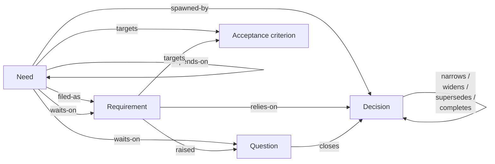

# gy — good,yes

English | [日本語](README.ja.md)

## What is gy?

gy aims to free you from the chores of "telling the AI the context it needs, and organizing that context so it gets across", so that you finish your work sooner and go home earlier.
Concretely, it takes the large amount of context that arises "after the need, before the deliverable" and holds it, together with strict invariants, as a graph of the following nodes and edges.


```mermaid
flowchart LR
  N[Need]
  Q[Question]
  D[Decision]
  R[Requirement]
  AC[Acceptance criterion]
  N -- spawned-by --> D
  N -- filed-as --> R
  N -- waits-on --> Q
  N -- waits-on --> R
  N -- depends-on --> N
  N -- targets --> AC
  R -- targets --> AC
  R -- relies-on --> D
  R -- raised --> Q
  Q -- closes --> D
  D -- "narrows /<br> widens /<br> supersedes /<br> completes" --> D
```

Using it is simple:

1. Make the AI aware of gy
   (a skill named `gy-loop` is bundled, so telling it "from today, let's work along gy-loop" is enough)
2. Tell it what you want to do and why it is needed

That is all. From then on, even in a new session, ask the AI "what's next?" and it tells you what to do next.
Details come later, but the moment gy helps most is when you overturn one of your own past decisions.

## How to use

### Install

```sh
cargo install gy

# optional (the quick way to tell the AI about `gy`)
npx skills add aq2bq/gy
```

Once a day gy runs `cargo info gy` to check for a newer release, and `gy handover` and `gy next` tell you when there is one. Unless you share a ledger with a team, that is the only network request gy makes.

### Telling the AI about gy

Put a sentence like the following in a prompt or in AGENTS.md / CLAUDE.md so it gets across, and the AI agent resumes from `gy handover` and `gy next` every time.

```
This project tracks its progress in gy. Before you start or resume anything, read the gy-loop skill and follow the record.
```

### Where the record itself lives

The record itself is saved by default under `$XDG_DATA_HOME/gy/<hash of the repository root>/`. Unless you set up team sharing (described below), gy never goes out to the network. Putting it inside the project's repository is not recommended, because the cycle of changes "after the need, before the deliverable" and the cycle of changes to the deliverable are completely different.

### [EXPERIMENTAL] Using gy as a team / putting the record on a remote

Still experimental, but

```shell
gy remote set https://github.com/you/yourproject-gy.git
```

sets a remote repository, and from then on `gy remote sync` is called in the background to keep it in sync. To share gy with other members, share the repository and have them run `gy remote join`. That is all.

#### About EXPERIMENTAL

- I built this feature over a holiday week, so the author has not used it with a team
- More than whether the sync mechanism works, I expect it will not go well without some discipline that gy cannot cover

## Mental model: "leave the project's context to gy, and face the decisions yourself"

- The explanation at every resume goes away. After resetting a session you no longer write "we are at this issue, the process is in this file, last time we finished this PR, next is X". The agent starts from `gy handover` and `gy next`.
- On "how much, and what, to tell the AI" when conveying a need: telling it in detail leads to the questions and the acceptance criteria being on the table early, and telling it "a rough fantasy for now" leads to a way of working where the necessary decisions are postponed. In the end, the number of decisions needed does not change.
- When you overturn a past decision, the new decision cannot be written without quoting which part of the old decision loses effect. The mark goes on the quoted passage only, and the rest stays in force. gy does not find the contradiction for you. Because the work being picked up is connected to that decision node by edges, the AI can understand which decisions are in force.

What remains for the human is deciding, and only deciding. Goals and needs, and answers to the questions and options the AI presents. The first line of `gy-loop` says the same: "A person cannot escape the critical decisions. gy frees them from everything else."

## The view for humans: gy serve

To look at the record yourself, use `gy serve`. The screenshots show a demo ledger built by `scripts/demo-ledger.sh`. Before you have a record of your own, run it and `gy serve` to see the same.

### Now


### Graph


### Node detail


## What the ledger holds

| Node | What it is |
| --- | --- |
| need `n-…` | What you want done. Points at acceptance criteria |
| question `q-…` | Something to decide, with a decider and at least two options |
| decision `d-…` | What was decided, with where it holds |
| requirement `r-…` | A promise of what will be built. Work starts after it is approved |
| criterion `ac-…` | What has to be true for the work to count as finished |

A criterion can be recorded as satisfied only while an approved requirement points at it. Who approves is up to you, not gy.

## Who writes

Every write needs a name in `GY_ACTOR`. Give each agent its own name, and the history shows who wrote what and why.

## Commands

`gy cheat` lists them, but every write prints the commands you can type next, so there is nothing to memorize. `gy undo` takes back the last write, and the undo stays in the history too. `gy publish` writes the ledger out as a Markdown wiki you can read on GitHub.

## gy.toml

`gy init <scope>` creates it. It holds only the scope names, plus the publish output directory and the remote if you want them.

## Development

```sh
cargo fmt --all -- --check
cargo clippy --workspace --all-targets --locked -- -D warnings
cargo test --workspace --locked
```

The workspace holds `gy-ledger` (the store, model, and operations), `gy-serve` (the read-only web view), and `gy` (the CLI). CI tests on Linux; other platforms are unverified. The screens of `gy serve` have their own end-to-end tests under `e2e/` (Playwright, chromium): see [e2e/README.md](e2e/README.md); they are not part of `cargo test`.
